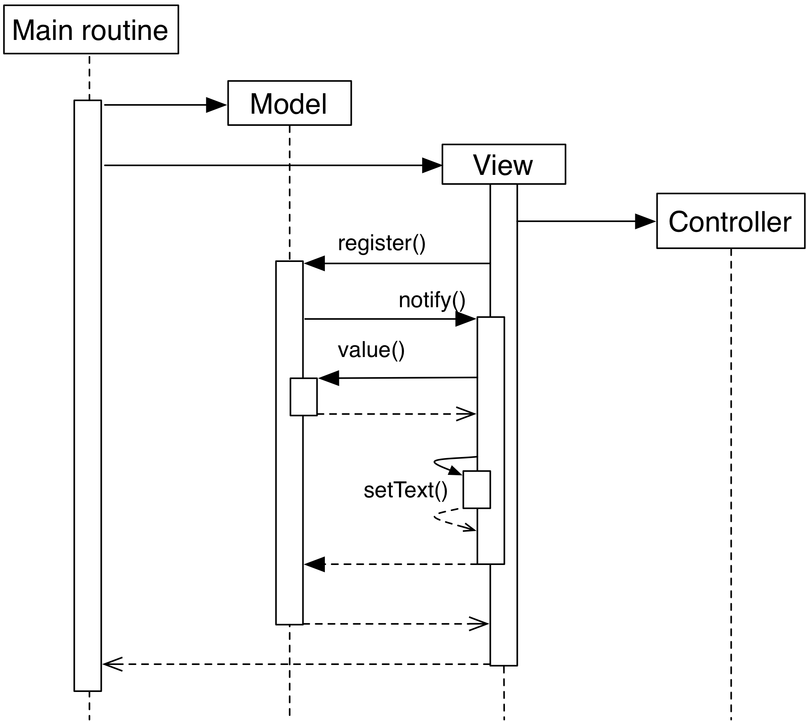

# 1.3 Traditional MVC

With the Document-View design we successfully extracted state from an initial
Smart-UI design. The next objective is to extract the code that converts the
primary event (in this case, a mouse click on the button) into the execution of
the logic that modifies the state (addition of one to the value). The final
result of this refactoring will be a **Traditional MVC** design[^1].

In Traditional MVC, the Document is called **Model**, and its role 
and structure is unchanged: it stores state and delivers change
notifications. The View part in Document-View is instead removed 
of some of its responsibilities, that are given to a **Controller**. 
Once instantiated and connected, Model, View, and Controller form a 
so-called **MVC triad**.

<p align="center">
  
</p>

The Controller's role is to transform primary events delivered by the View into
operations on the Model. Depending on the specifics of the application, a Controller may or may not need
a reference to the View, but it certainly needs the Model to apply changes on

```python
class Controller(object):
   def __init__(self, model, view):
       self._model = model
       self._view = view
```

The method ``add_one`` performs the specific task of transforming a primary event
into a Model operation, adding one to the current value.  Obviously, the
Controller does so through the Model interface. This operation will trigger a
Model notification to its listeners 

```python
class Controller(object):
    # ...
    def add_one(self):
        self._model.value += 1 
```

At initialization, the View instantiates its associated Controller, passing
itself and the Model as parameters. As before, the View registers itself on the
Model via the ``register`` method 

```python
class View(QtGui.QPushButton):
    def __init__(self, model):
        super(View, self).__init__()
        self._model = model
        self._controller = Controller(self._model, self)
        self._model.register(self)
```

The View now depends on the Controller to modify the Model: only strictly
GUI-related handling is done by the View. Conversion from GUI events to
application business logic is delegated to the Controller in
``mouseReleaseEvent`` 

```python
class View(QtGui.QPushButton):
    # ...
    def mouseReleaseEvent(self, event):
        super(View, self).mouseReleaseEvent(event)  
        self._controller.addOne()  

    def notify(self):
        self.setText(unicode(self._model.value()))   
```

Clicking on the View button will result in a call to ``Controller.add_one``, in
turn triggering a call to ``notify`` that updates the text label. The activity
diagram shows the dance of calls presented above. Note how the Model-View
synchronization does not involve the Controller

<p align="center">
  
</p>

To initialize the MVC triad, the client code needs to create the Model and
View, and let them be aware of each other by passing the Model to the View. 

```python
app = QtGui.QApplication(sys.argv)

model = Model()
view = View(model)
view.show()

app.exec_()
```

The activity diagram shows the setup code given above

<p align="center">
  
</p>

---
**Note**

The more knowledgeable reader may recognize that this MVC model 
is not the original MVC as intended in its original implementation. 
We will go into detail of the differences in later chapters. 
What is presented here is the modern reinterpretation of the 
original MVC, and the one most likely to be intended when talking 
about "MVC". To clarify the overloaded nomenclature, I chose to 
refer to the original '70s design as  "Reenskaug MVC", and its 
modern reinterpretation here presented as "Traditional MVC".
----
