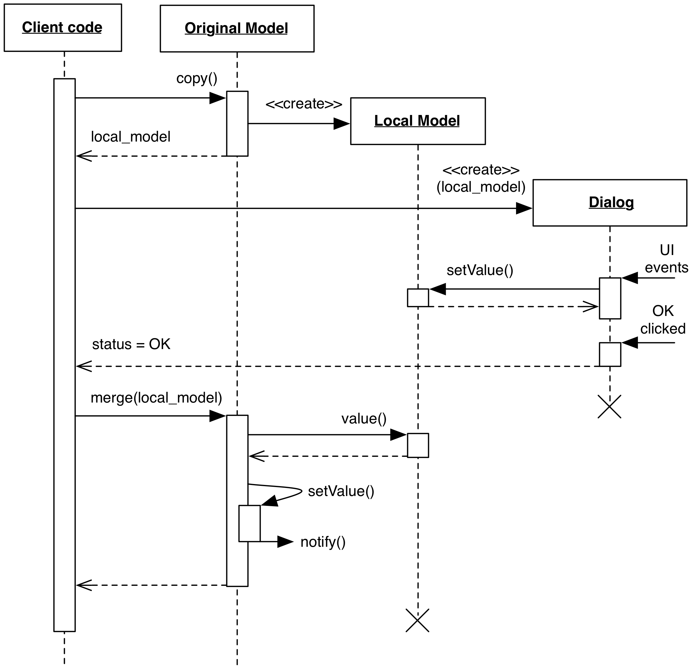

# 2.1.7 Local Model

### Motivation

A common use case of GUI interaction is to spawn a dialog containing 
configuration options, and let the user apply (through an "Ok" button) or 
discard (through "Cancel") his changes.

A Local Model allows the above use case by letting the Dialog View operate 
on a copy of the Original Model. The copy can then be either discarded 
(if "Cancel" is clicked), or merged with the Original Model (if "Ok" 
is clicked). This approach guarantees that business rules of the Model 
are enforced while changes are made on the data.

An important limiting factor to this pattern is the possibility that 
the Original Model holds a reference and modifies (either directly or
through notification) another Referenced Model object. If the copy is shallow,
the Local Model might perform irreversible changes to the Referenced
Model, leading to an inconsistent state. In this case, possible 
solutions are:

- perform a deep copy of the Local Model to create a completely
  isolated model network. This will generate a copy of Referenced Model as well. 
  When the dialog is closed with "Ok", the whole network must be synchronized 
  with the Original Model, an operation that might be complex. In particular,
  notifications must be disabled during the merge operation, otherwise a cascade 
  of notification side effects may occur. As a consequence, this approach is only
  acceptable for small networks, but explodes in complexity and cost for larger ones.
- Use a "puppet" model that holds the relevant data from Original Model. The puppet 
  will have no connections to Referenced Model, nor any change listeners attached. 
  Apply the pattern to the puppet model and, on "Ok", apply the relevant changes from the
  puppet model to the Original Model.
- Abandon the pattern altogether and have the dialog work live on the Original
  Model, and implement Undo through a Command Pattern whenever possible.

### Design

Models needing support for this strategy generally implement:
- a `copy()` method (or similar), creating and returning a copy of 
  itself.
- an `update(local_model)` or `merge(local_model)` method, updating 
  the Original Model's data with the Local Model data. Alternatively, 
  the Original model can be replaced altogether.

When the Dialog is requested by a user operation, the Original Model is 
copied. This copy (Local Model) is passed as a Model to the Dialog. 
User's operations on the Dialog are applied to the Local Model, and 
these changes must not influence the rest of the application, meaning that listeners must not be copied.

    

If the user dismisses the Dialog with "Cancel", the Dialog is closed and the 
Local Model is simply discarded. When the user clicks on "Ok", 
the controlling code submits the Local Model to the Original Model 
via `update()`. Changes are verified and merged, and if actual changes 
exist the Original Model notifies its listeners.

Optionally, the View can also have a "Revert" button which either 
performs a merge in the opposite direction (Original onto Local) or 
simply creates a new copy of the Original Model, discards the old 
Local Model, and sets the Dialog to observe the new copy.

