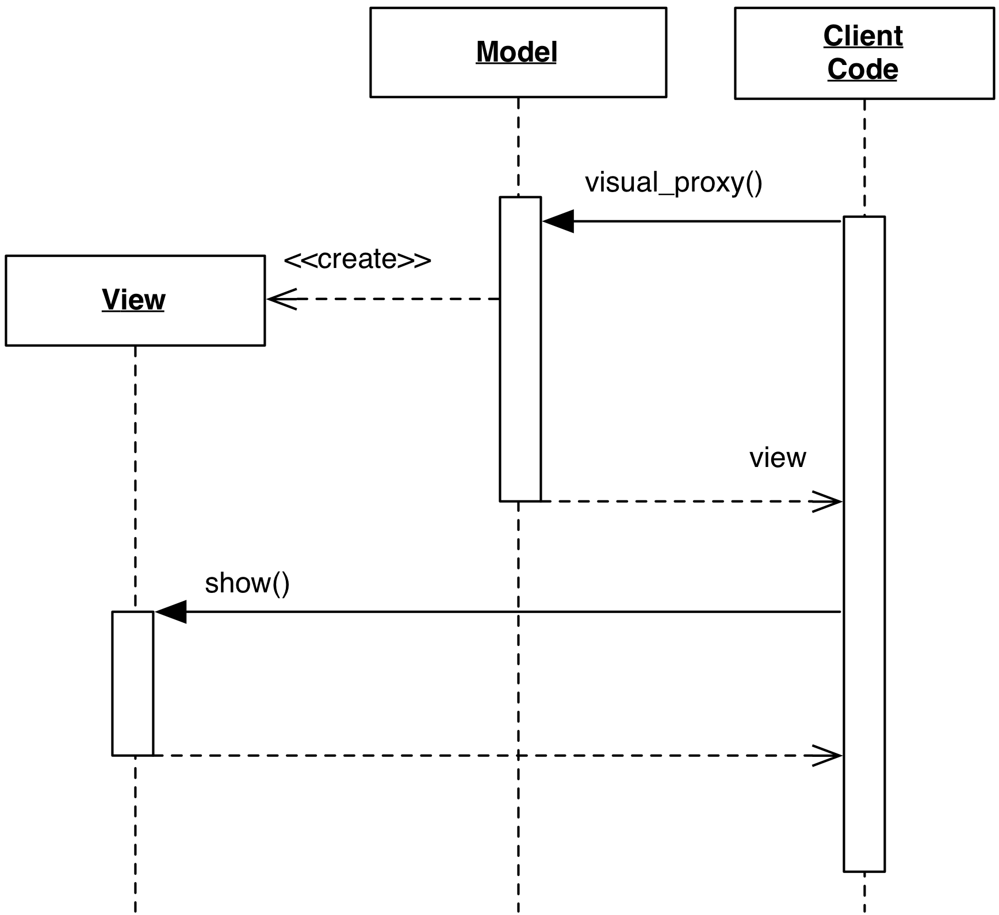

# 2.2.4 Visual Proxy

### Motivation

Visual Proxy is an approach first presented by Allen Holub in 1999. It
it is wildly different from the previous approaches, but definitely contains
interesting ideas. Holub argues the following:

- It is very rare for the same Model to be represented at the same 
  time in two different ways
- Model representation is not about the Model object per-se, but
  for some specific attributes of that object. These attributes 
  can be presented with a well defined UI widget, regardless of 
  where they will appear in the View. For example, 
  ``Person.name`` is invariably represented as a string, 
  and its View presentation is an editable textfield widget throughout
  the application
- All Model designs generally assume a get/set approach to
  Model state modification. From a strict Object Oriented interpretation,
  getter/setters is a *faux pas* and should be avoided, as they are
  just access to private state in disguise
- Essential separation between Model and View is clumsy to
  achieve in MVC, which does not scale well at the application level
- An Object Oriented system should focus on objects issuing behavior
  requests to one another, with the data staying put. The previous designs
  instead focus on data transfer from the view to the model, and *vice-versa*.

Out of these considerations, the proposed alternative is to let Models 
create their own Views, according to the data they hold. For example, 
a Model containing a string, a date and an integer range return 
a View containing a LineEdit, a Calendar and a Spinbox constrained
to the the appropriate range.

This approach, while appealing in its cleverness, is not without 
shortcomings. Responsibilities that are traditionally handled by 
the View layer are now handled, directly or indirectly, by the Model:

- The Model layer has a dependency on the GUI toolkit.
  This may have deep implications for testability, reuse, and 
  requirements for the Model layer
- If the Visual Proxy contains static parts (such as a "Name" label
  followed by the line editor to input the name) the Model objects 
  have to handle localization of the "Name" string in other languages
- Logical dependencies between visual components (*e.g.* when this 
  value is 1, enable that checkbox) must also be moved to the 
  Model layer.

Note that this approach is different from a UI Retrieving Model. 
The latter considers the User as a source of data, and generates
a short-lived UI for that specific retrieval. Visual Proxy, on the 
other hand, is a full fledged foundation of all Model objects 
to provide their own View as implicitly described by their data.

Visual Proxy should also not be confused with View-aware Model,
as they handle different concerns: Visual Proxy deals with 
View's creation. View-aware Model deals with Model-View 
synchronization. 

### Design

Model objects act as factories for the UI of their own attributes

<p align="center">
    
</p>

The resulting message flow is simplified: all the data synchronization happens 
between the Visual Proxy and its backend attribute. The Client code
is not concerned with this transaction. It just coordinates
creation and presentation of the Visual Proxy object to the User.

# Practical Example 

The following practical example represents a boilerplate 
implementation of the design, for clarity purposes. 
Two methods are provided to generate a Visual Proxy: 
`visual_proxy_attribute` returns the Proxy for a specific 
attribute of the Person Model class; `visual_proxy` returns 
instead the full UI representation of the Model properties.

For simplicity of presentation, this example only performs 
synchronization in one direction, from the View to the Model.
Changes in the Model are not updating the View.

```python
class Person(object):
    def __init__(self, name="", surname="", age=0):
        self._name = name
        self._surname = surname
        self._age = age

    def visual_proxy(self, read_only=False):
        view = QWidget()
        layout = QGridLayout()
        for row, attr in enumerate(["name", "surname", "age"]):
            layout.addWidget(QLabel(attr), row, 0)
            layout.addWidget(self.visual_proxy_attribute(attr, read_only), row, 1)
        view.setLayout(layout)
        return view
        
    def visual_proxy_attribute(self, attribute, read_only=False):
        method = getattr(self, "_create_{}_view".format(attribute))
        return method(read_only)

    def _update_name(self, name):
        self._name = name

    def _update_surname(self, surname):
        self._surname = surname

    def _update_age(self, age):
        self._age = age

    def _create_name_view(self, read_only):
        if read_only:
            widget = QLabel(self._name)
        else:
            widget = QLineEdit()
            widget.setText(self._name)
            widget.textChanged.connect(self._update_name)

        return widget

    def _create_surname_view(self, read_only):
        if read_only:
            widget = QLabel(self._surname)
        else:
            widget = QLineEdit()
            widget.setText(self._surname)
            widget.textChanged.connect(self._update_surname)

        return widget

    def _create_age_view(self, read_only):
        if read_only:
            widget = QLabel(str(self._age))
        else:
            widget = QSpinBox()
            widget.setValue(self._age)
            widget.valueChanged.connect(self._update_age)

        return widget

    def __str__(self):
        return "Name: {}\nSurname: {}\nAge: {}".format(self._name, self._surname, self._age)
```

Client code can now request the Visual Proxy by issuing:

```python
person = Person(name="John", surname="Smith", age=18)
view = person.visual_proxy()
view.show()
```

### Practical Example: Enthought traits

A more streamlined approach to the Visual Proxy design is provided 
by Enthought Traits/TraitsUI. Boilerplate code is removed
installing automatic bindings between Model properties and UI widgets, 
and automatically selecting the appropriate mapping between data types 
and their UI representation.

The Model is defined through type-enforcing python descriptors. 
```python
class Person(HasTraits):
   name = Str
   surname = Str
   age = Range(0, 100)
```

and the Visual Proxy is obtained by invoking `edit_traits()`

```python
person = Person()
ui = person.edit_traits()
```

which results in a window containing two LineEdit and a Slider.
