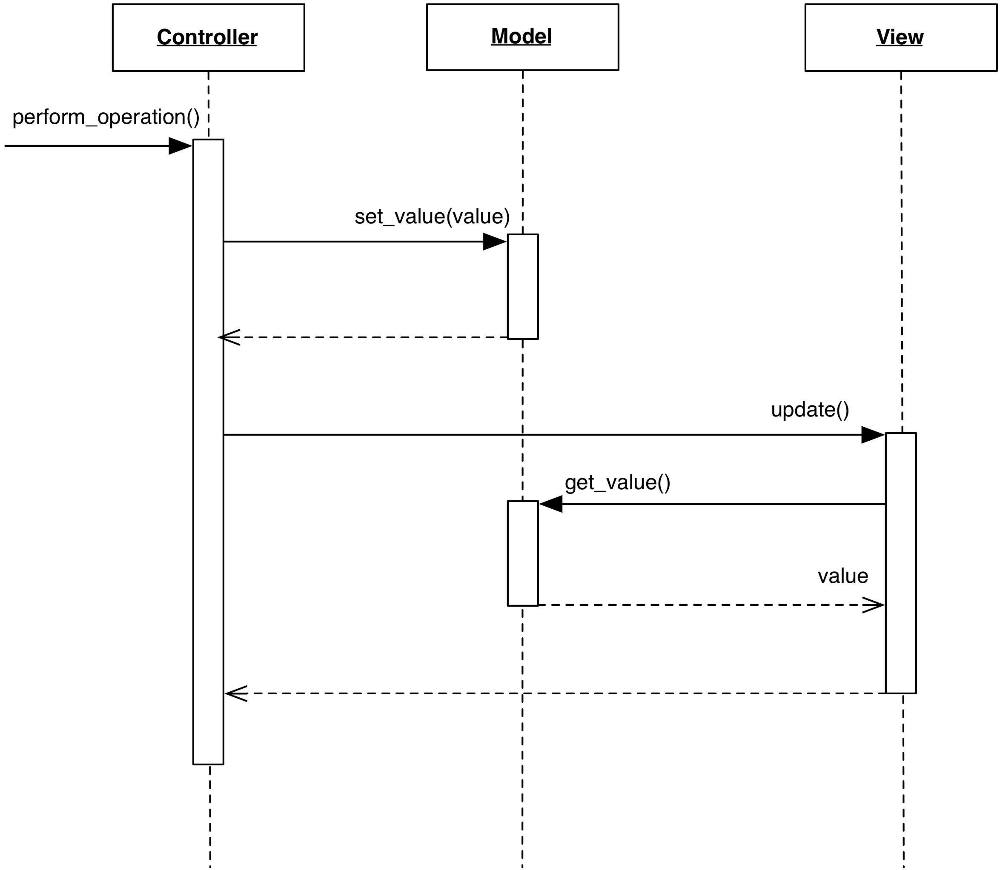

# 2.4.3 Passive Model

### Motivation

Traditional MVC uses the so-called **Active Model**: when the Model changes its
listeners are notified of the change. Its counterpart is the **Passive Model**
which does not perform notification services. Instead, this task is performed
by the Controller.

Passive Model has its area of excellence in Web-based MVC, where the
fundamental nature of the HTTP protocol prevents the Model to 
notify the View. It is also relevant for all those cases where notifications 
cannot be produced because the data source is unable to provide this service,
such as most databases or a plain file.

### Design

The interaction diagram shows the behavior of a Passive Model

<p align="center">
    
</p>

Specifically, the sequence of events is:

1. The Controller modifies the Model
2. The Controller informs the View to update itself
3. The View now inquires the Model contents as in the Active case.

The major shortcoming of a Passive Model is that Views get desynchronized
if multiple Controllers can modify the Model. Collaboration between Controllers
can prevent this desynchronization, but for all practical purposes an Active
Model quickly becomes a better solution. If this is required, a Passive Model
can become Active either through inheritance or by using a wrapper class
satisfying the Passive Model's original interface. This wrapper will receive
change requests from Controllers, delegate them to the Passive Model, and
finally notify the listeners. 

Despite the disadvantage, the Passive Model has the following important advantages: 

- Any object (e.g. a key-value dictionary, a list, a single value, a previously
  developed business object) can be used as a Model without modifications
- It allows better control on the refresh of the View. The Controller
  can issue multiple changes to the Model without triggering a View's refresh 
  for each change
- As commented in the Motivation section, Web-based MVC cannot use an 
  Active Model strategy due to the intrinsic separation of Models from 
  rendered Views.

### Practical Example: Django MVC

The web framework Django is our choice to present a simple case of Passive
Model. Please note that this example is not meant to be considered orthodox
Django style, and has been stripped beyond the bare minimum to illustrate 
the topic.

A Model in Django is specified as a python class with appropriate descriptors

```python
class Article(models.Model):
    title = models.CharField(max_length=200)
    text = models.CharField()
```

This model is backed by a database, which stores the actual state. It is unable to
deliver notification in case of database content changes, and is therefore a
Passive Model. In the trivial case of Web backend MVC here presented, the need for 
notification does not emerge because the refreshing of the View is triggered
by an explicit browser request. The Controller handles this request,
retrieves the Model, performs any required action, and renders the View with the
updated data.

```python
def modify_article(request, article_id):
    article = get_object_or_404(Article, pk=article_id)

    # These changes do not trigger any notification. The model is passive.
    article.title = request.POST["title"]
    article.text = request.POST["text"]

    # Persist the replaced data.
    article.save()

    template = Template("<html><body>"
                        "<h1>{{ article.title }}</h1>"
                        "<p>{{ article.text }}</p>"
                        "</body></html>")
    context = { "article" : article }
    html_doc = template.render(context)

    return HttpResponse(html_doc)
```

### References

- [MSDN documentation: Model-View-Controller. Passive Model](https://msdn.microsoft.com/en-us/library/ff649643.aspx)
