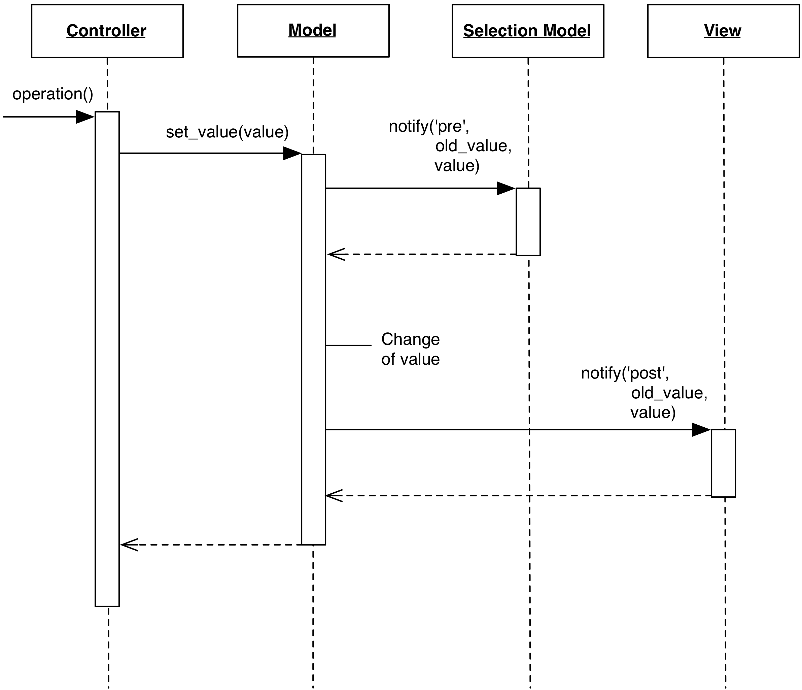

# 2.4.6 Pre/Post notification

### Motivation

The Model wants to inform its listeners not only when data have been changed,
but also just before changing them. A common reason behind this need is to support
vetoing, but other motivations may exist.

### Design

To implement Pre/Post notification, the Model simply issues two different
notifications, one before changing the Model state, and one after.

    

These notifications must be qualified, otherwise the interested listeners
would not be able to differentiate the pre-vs-post nature of the received 
notification.  For example, a Model could issue ``about_to_change``, apply the
change, and finally issue ``changed``.  Both the old and new value are also
generally passed as part of the notification.

### Practical Example

Although other approaches could be used to handle this specific use case,
pre-notifications can be useful to keep a Selection Model synchronized when
the View in not collaborative in handling a selection referring to a
non-existent entry.

Our example has a Model containing a list of items, and a Selection Model 
holding information about which items in the Model are selected. 
If the View cannot handle selection of items not present in the Model,
the following scenario would break the View:

1. An item of the Model is currently selected. This implies that an entry 
   for this item is present in the Selection Model.
2. A Controller issues a request to the Model to remove the item. Note that the
   controller may not be aware of the existence of a Selection Model, so it is
   unable to deselect the item to prevent this scenario.
3. The Model removes the item, and notifies the View of its change.
4. The View renders the Model, followed by rendering the Selection, but 
   the selected item is no longer in the Model. The View cannot handle 
   this situation and issues an exception.

Using a pre-notification can work around the View implementation detail:

1. A Controller issues a request to the Model to remove the item.
2. The Model issues an "about to remove item" pre-notification.
3. The Selection Model listens and receives the Model pre-notification.
4. The Selection Model reacts by removing the item from its internal state.
5. The Selection Model change triggers a notification to the View which is handled
   by visually deselecting the item. The Model hasn't changed yet, so the 
   View is retrieving valid data.
6. Finally, the Model removes the item, and post-notifies the View to 
   re-render itself with one less item.

Through pre-notification, the View retrives consistent data throughout the
operation.  Without the existence of the pre-notification, we would have to
rely on the order of notification of the post-notification to notify the
Selection Model first, then the View. In general, it is not good practice to
rely on ordering of different listeners on the same notification channel,
because the order may not be guaranteed by the notification framework.
