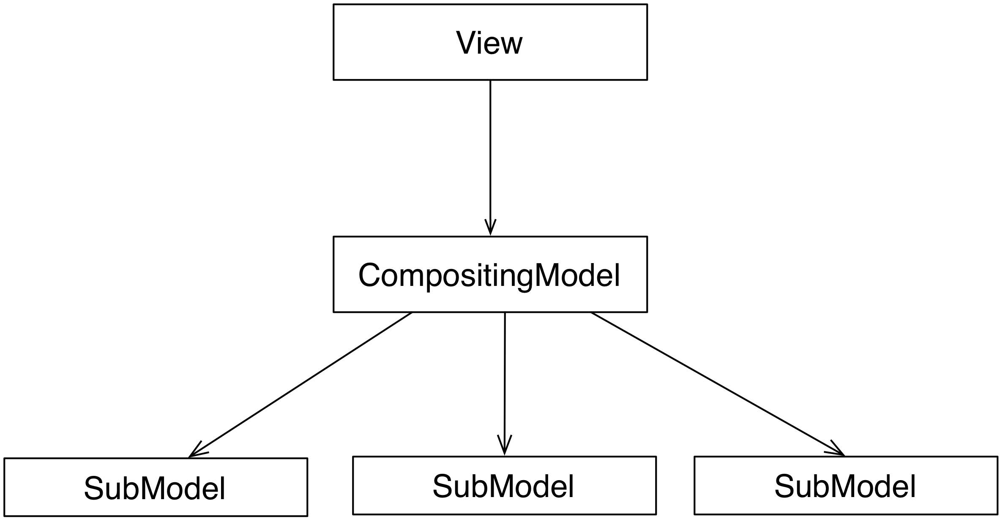
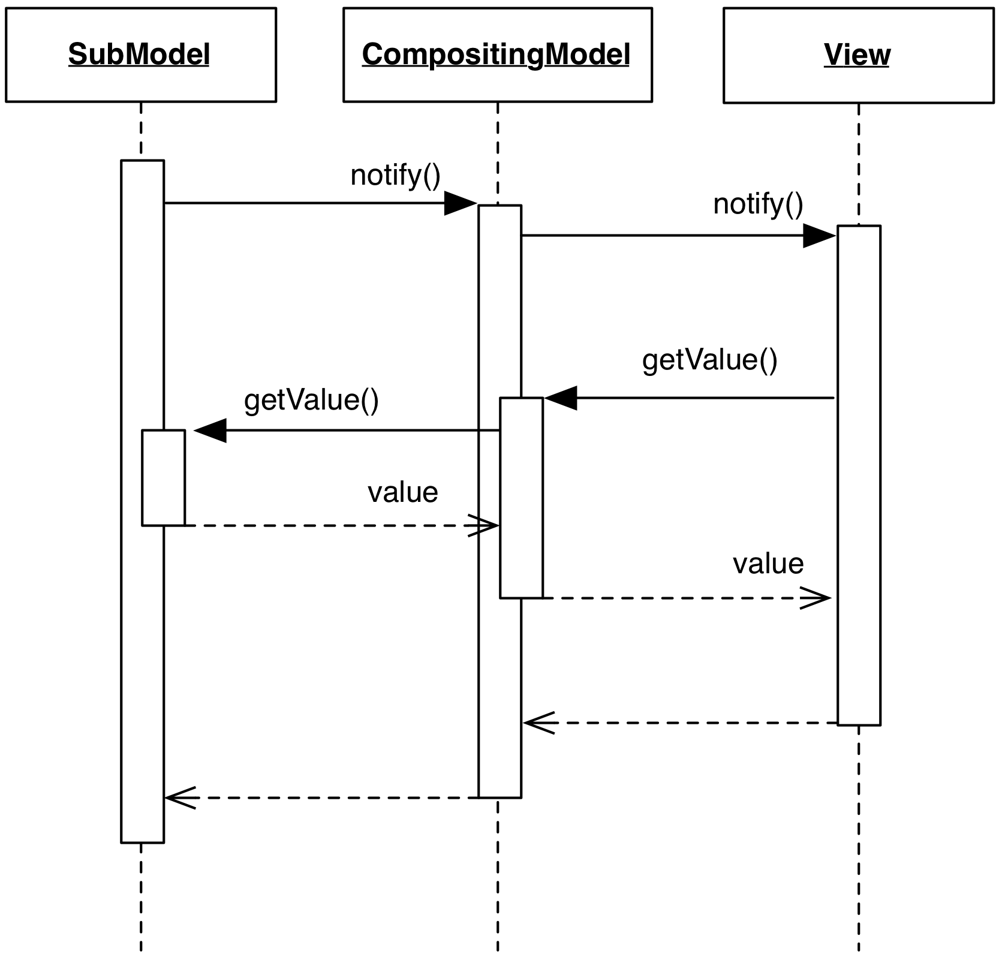

# Compositing Model

### Motivation

A Compositing Model aggregates data from multiple Model objects so that the
View has a single and uniform point of access for its data source. 
A typical use case is to perform union of homogeneous information 
originating from different sources, or to extract relevant
information from different Models and present them in an easy to query Façade.
These Compositing Models are normally conceived to simplify access for a 
View with specific presentation objectives. 

A Compositing Model can also compose objects of different nature that need 
to be joined through a complex relation. For example, a `CustomerHistory` 
Model could combine Models `Customers` and `Orders`, returning the combined 
information to the View.

In this sense, the Model follows the needs of the View, because
the existence of this Model object is implied by the specific View 
needs to represent this particular data aggregate.

### Design

The Compositing Model acts both as listener and notifier. It holds references 
to its SubModels, and registers on them as a listener. The Compositing Model 
life cycle can be temporary. SubModels can have an independent life cycle.
The View interacts only with the Compositing Model. Other Views 
(or Controllers) can interact directly with the SubModels.

<p align="center">
     
</p>

Notifications from individual SubModels are received and re-issued by the
Compositing Model to notify the View. Vice-versa, data requests issued by 
the View on the Compositing Model are routed to the appropriate SubModel. 

<p align="center">
     
</p>

Controllers can act either on the Compositing Model, or any of the Submodels.
In the first case, the Compositing Model forwards the modification request
to the appropriate Submodel according to some criteria. The Compositing Model 
is therefore acting as a surrogate Controller. The SubModel will then issue 
the notification, which is propagated as explained above. 

If a Controller instead acts on a SubModel, the Compositing Model will 
simply forward the Submodel's notification to the View.

### Practical example

As a practical example of the Compositing Model, we will create a trivial 
address book application whose data sources are two
comma-separated (CSV) files and one XML file. The objective is to have a View
that can display data regardless of the sources, and that allows
extension to other storage formats without excessive modifications. The final
application is a simple Qt ListWidget with one name and telephone number per
each row

<p align="center">
     
</p>

The Model layer is composed of three classes: two of them provide readonly
access to each file format (CSV or XML). The third uses the previous two,
manipulating the data for more convenient handling, in this case merging. The
resulting class ``AddressBook`` is a Compositing Model.

<p align="center">
    
</p>

The code for class ``AddressBookCSV`` is here shown to illustrate the rather
trivial interface supported by all Model objects. The common base class
``BaseModel`` provides notification services by implementing
``register``, ``unregister``, ``notifyListeners``, and the listeners set.

```python
class AddressBookCSV(BaseModel):
   def __init__(self, filename):
       super(AddressBookCSV, self).__init__()
       self._filename = filename

   def numEntries(self):
       try:
           return len(open(self._filename, "r").readlines())
       except:
           return 0

   def getEntry(self, entry_number):
       try:
           line = open(self._filename, "r").readlines()[entry_number]
           name, phone = line.split(',')
           return { 'name' : name.strip(), 'phone' : phone.strip()}
       except:
           raise IndexError("Invalid entry %d" % entry_number)
```

The code for the View is simplified by the fact that there's no Controller. No
modifications are allowed on our Models, so no GUI events need to be handled

```python
class AddressBookView(QtGui.QListWidget):
    def __init__(self, model, *args, **kwargs):
        super(QtGui.QListWidget, self).__init__(*args, **kwargs)
        self._model = model

        self._model.register(self)
```

The ``notify`` method extracts data from the Model and repopulates the ListWidget after clearing it. As a general rule, this method is rather aggressive and may introduce flickering or loss of selection of the List items. Solving these issues is beyond the scope of this example. Additionally, the List does not need regular refresh cycles, because the Models are readonly and parsed only once at startup

```python
class AddressBookView(QtGui.QListWidget):
    # ...
    def notify(self):
        self.clear()

        for i in range(self._model.numEntries()):
            entry = self._model.getEntry(i)
            string = "%s (%s)" % (entry["name"], entry["phone"])
            self.addItem(string)
```

Note how the View is agnostic of the actual Model type, and can render data from either ``AddressBookCSV`` or ``AddressBookXML``. This is expected, as we are programming against an interface. The Compositing Model class ``AddressBook`` implements the same interface and will therefore be rendered transparently by the ``AddressBookView``. 

The ``AddressBook`` class accepts an arbitrary number of Models at initialization, and registers as a listener on each of them. The interface expected by ``AddressBookView`` is reimplemented, deriving the data from the composition of the submodels 

```python
class AddressBook(BaseModel):
   def __init__(self, models):
       super(AddressBook, self).__init__()

       self._models = models

       for m in self._models:
           m.register(self)
```

The total number of entries is trivially the sum of the number of entries
provided by each submodel 

```python
class AddressBook(BaseModel):
    # ...
    def numEntries(self):
        return sum([m.numEntries() for m in self._models])
```

To get a specific entry, we need to map the absolute entry number to the
relative entry number in a specific submodel, keeping into account the number
of elements in each submodel. We define the accumulate routine to compensate
for the lack of it in python2 

```python
class AddressBook(BaseModel):
    # ...
    def getEntry(self, entry_number):
        def accumulate(l):
            current_total = 0
            res = []
            for i in l:
                current_total += i
                res.append(current_total)
            return res
        accumulated = accumulate([m.numEntries() for m in self._models])
        source_idx = map(lambda x: x <= entry_number,
                         accumulated).index(False)
        try:
            return self._models[source_idx].getEntry(
                                   entry_number - accumulated[source_idx]
                                   )
        except:
            raise IndexError("Invalid entry %d" % entry_number)
```

Finally, when any of the submodels notify a change, the Compositing Model
should just perform a notification to its listener, in our case the
``AddressBookView``

```python
class AddressBook(BaseModel):
    # ...
    def notify(self):
        self.notifyListeners()
```

The application main routine creates the three datasource models, and passes
them to the Compositing Model ``AddressBook``, which is then passed to the View 

```python
csv1_model = AddressBookCSV("file1.csv")
xml_model = AddressBookXML("file.xml")
csv2_model = AddressBookCSV("file2.csv")

address_book = AddressBook([csv1_model, xml_model, csv2_model])

view = AddressBookView(address_book)
```

