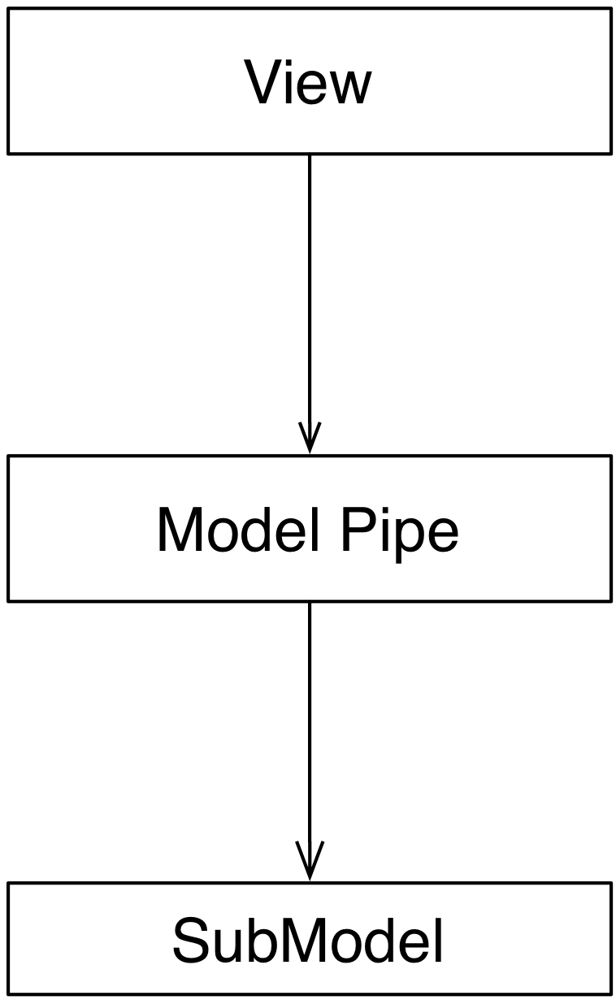

# Model Pipe

### Motivation

The **Model Pipe** is a variation of the Compositing Model approach,
and similar in concept to a UNIX pipe: it intercepts and
manipulates the data flowing from Model to View. Like in a UNIX pipe, 
Model Pipes with different manipulation logic can be chained together 
to perform sequential alteration of data.  Typical application of Model Pipe 
are for filtering and sorting.

### Design

The Model Pipe encapsulates data transformation logic in a dedicated,
reusable class. Different Pipe classes can be created, each
with specific capabilities. 

<p align="center">
    
</p>

To be compatible with the View, a Model Pipe implements the same interface 
of the SubModel, eventually extending it to provide access to additional state 
it might contain. For example, a filtering Model Pipe will host data about the
current filter string. Controllers acting on the Model Pipe act on this state. 

The Model Pipe is a listener of the SubModel and forwards its events. In
addition, it performs notification when its internal state changes in a way
that modifies the resulting data.

while the manipulation of the SubModel's data is performed 
directly on the SubModel itself. 

### Practical Example: Qt QSortFilterProxyModel

Qt provides a Pipe Model with sorting and filtering functionality: ``QSortFilterProxyModel``.
It is worth noting that Qt calls this Model "Proxy Model", but in the context of this book, 
Proxy Model refers to a different Model design.

The implementation sets up a Pipe Model connection between ``MyModel`` and a Tree View.
The Tree View observes the Pipe Model, which in turns uses ``MyModel`` as a data source.

```python
tree_view = QTreeView()
model = MyModel()
pipe_model = QSortFilterProxyModel()
pipe_model.setSourceModel(model)
tree_view.setModel(pipe_model)
```

The Model Pipe provides an appropriate interface to configure the filter, like
``setFilterRegExp``, and mapping routines ``mapToSource()`` and ``mapFromSource()`` 
to convert between index of an Item in the Model and index of that Item 
in the View. 


### Practical Example: manual implementation

This example will show a trivial implementation of a Filter Model


<p align="center">
    
</p>

The implementation will also require two separated Views, both contained in the
same window: the ``AddressBookView`` was introduced in the previous section and
will be connected to the Filter Model as the end point of the Model chain; The
``FilterView`` will instead display and modify the filter string, and will
connect to the ``AddressBookFilter`` Model.  We will explain the motivations
for this design later in the explanation. 

The ``AddressBookFilter`` registers on the filtered Model and holds the current
filter string

```python
class AddressBookFilter(Model):
   def __init__(self, model):
       super(AddressBookFilter, self).__init__()
       self._filter_string = ""
       self._model = model
       self._model.register(self)

    def setFilter(self, string):
        self._filter_string = string
        self._notifyListeners()

    def numEntries(self):
        entries = 0
        for i in xrange(self._model.numEntries()):
            entry = self._model.getEntry(i)
            if self._filter_string in entry["name"]:
                entries += 1
    
        return entries
    
    def getEntry(self, entry_number):
        entries = 0
        for i in xrange(self._model.numEntries()):
            entry = self._model.getEntry(i)
            if self._filter_string in entry["name"]:
                if entries == entry_number:
                    return entry
                entries += 1
    
        raise IndexError("Invalid entry %d" % entry_number)

    def notify(self):
        self._notifyListeners()

```

To modify the filter string, we need a ``setFilter`` method. When a new string is
set, the product of the ``AddressBookFilter`` Model is expected to change, so
``_notifyListeners`` is called. 

The actual filtering is performed on the fly on the underlying data in the
``numEntries`` and ``getEntry`` methods, which is the usual interface for the
Model in the address book application 

Finally, the Filter forwards notifications from its submodel to its listeners 

Finally, we need a View and Controller to modify the filter string. The View is
a QLineEdit with some layouting and labeling. Its signal ``textChanged`` triggers the Controller's ``applyFilter`` method, so that as new characters are typed in, the Controller will change the filter string. Note how ``FilterView`` does not need a ``notify`` method: we don't expect the filter string to change from external sources, and ``QLineEdit`` is an autonomous widget which keeps its own state and representation synchronized 

```python
class FilterView(QtGui.QWidget):
   def __init__(self, *args, **kwargs):
       super(QtGui.QWidget, self).__init__(*args, **kwargs)
       self._initGUI()
       self._model = None
       self._controller = FilterController(self._model)
       self.connect(self._filter_lineedit,
                    QtCore.SIGNAL("textChanged(QString)"),
                    self._controller.applyFilter
                    )
   def _initGUI(self):
       self._hlayout = QtGui.QHBoxLayout()
       self.setLayout(self._hlayout)
       self._filter_label = QtGui.QLabel("Filter", parent=self)
       self._hlayout.addWidget(self._filter_label)
       self._filter_lineedit = QtGui.QLineEdit(parent=self)
       self._hlayout.addWidget(self._filter_lineedit)
```

We want to delay the setting of the Model after instantiation, so we need a
setter method and design View and Controller to nicely handle None as a Model,
always a good practice [#]_. The reason for this delayed initialization is that
both ``FilterView`` and ``AddressBookView`` are visually contained into a dumb
container. We will detail this point when analyzing the container 

```
    def setModel(self, model):
        self._model = model
        self._controller.setModel(model)
```

The ``FilterController`` needs only the Model, initially set to ``None`` by the View 

```python
class FilterController(object):
   def __init__(self, model):
       self._model = model

   def setModel(self, model):
       self._model = model
```

The ``applyFilter`` method simply invokes ``setFilter`` on the associated Model, which must be the  AddressBookFilter instance. Due to Qt Signal/Slot mechanism, this method receives a ``QString`` as argument, so we need to convert it into a python string before setting it into the Model 

```python
    def applyFilter(self, filter_string):
        if self._model:
            self._model.setFilter(str(filter_string))
```

As described early, the final application will have two Views in the same
window, one above the other. To achieve this, we need a container widget to
layout the two Views. We don't want to convey any misdirection about this
container being anything else but a dumb container, so its initializer does not
accept the Models. We will instead set the Model on each individual View from
the outside through their setModel methods described earlier 

```python
class ContainerWidget(QtGui.QWidget):
   def __init__(self, *args, **kwargs):
       super(ContainerWidget, self).__init__(*args, **kwargs)
       self.filterview = FilterView(parent=self)
       self.addressbookview = AddressBookView(parent=self)
       self._vlayout = QtGui.QVBoxLayout()
       self.setLayout(self._vlayout)
       self._vlayout.addWidget(self.filterview)
       self._vlayout.addWidget(self.addressbookview)
```

```python
address_book = AddressBook()
```

The Pipes are then created and chained one after another 

```python
address_book_filter = AddressBookFilter(address_book)
address_book_sorter = AddressBookSorter(address_book_filter)
```

``AddressBookSorter`` will then be passed to ``AddressBookView`` to display the data at
the end of the process, and ``AddressBookFilter`` will be passed as a Model for
``FilterView``/``FilterController`` to modify the search string 

```python
widget = ContainerWidget()
widget.addressbookview.setModel(address_book_sorter)
widget.filterview.setModel(address_book_filter)
widget.show()
```

Why did we partition the GUI into two Views, instead of having a unified View
attached to the last Model in the chain and containing both the List and the
Filter line edit? This unified View would have to install its Controller to
modify the Filter string on an AddressBookFilter, but the passed Model is an
AddressBookSorter. The Sorter would therefore have to provide a method to
extract its submodel. The unified View would then invoke this method, hope that
the returned Model is a Filter, and finally pass it to the FilterController.
This would fail if the Sorter is removed from the schema, or another Pipe
object is added on either side of the Sorter. Such design is therefore rather
brittle. 

A solution with two separated Views give a more flexible, resilient and cleaner
design: the List does not need to know about the nature of its Model, it just
asks for its data; the Pipe chain can be modified without affecting the View;
The ``FilterView`` is attached to its natural Model, the ``AddressBookFilter``,
and its Controller can be installed safely without any fragile traversal of the
Pipe chain.

.. [#] Additionally, when a View or Controller allows to change the Model after
   initialization, it is important that ``setModel`` unregisters the View from the
   old Model, or it will keep sending change notifications. We skip this step
   because we never register for notifications in the first place.

