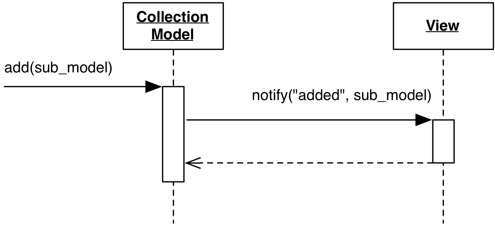

# Collection Model

### Motivation

A Collection Model is an open-ended container of SubModels. It is 
similar in concept to the Compositing Model, but the similarities are only
apparent. A Compositing Model:

- might be tailored to a specific number of SubModels.
- might hold SubModels of different types, handling and smoothing out 
  their differences.
- aims at unifying data coming from its SubModels, so that 
  their differences and separation are hidden to the View.

On the other hand, a Collection Model:

- Is an open-ended, potentially empty list of SubModels.
- The contained SubModels are of the same type.
- The Collection and its SubModels have independent nature and the 
  objective of the Collection is not to hide the intrinsic separation of the
  SubModels, rather to refer to them as a group.

A trivial example of a Collection Model is an `Album` containing `Song` objects.

### Design

The Collection Model is designed to notify its listeners 
when a SubModel is added, removed, or moved. In some cases,
the collection model can also notify listeners when any of its
SubModels changes.

<p align="center">
     
</p>

More complex implementations may want to provide events and an interface 
for bulk addition, bulk removal, or bulk move of SubModels. Qualified 
messages can inform the listeners what kind of change has occurred, and 
which SubModels were affected.

### Practical Example

Backbone.js Collection implements a Collection Model. The following code
represents an example of the API described above

```javascript
var album = new Backbone.Collection;

album.on("add", 
         function(song) {
            alert("Song added callback executed.");
         }
);

album.add([
  {name: "Mozart collection"},
]);


