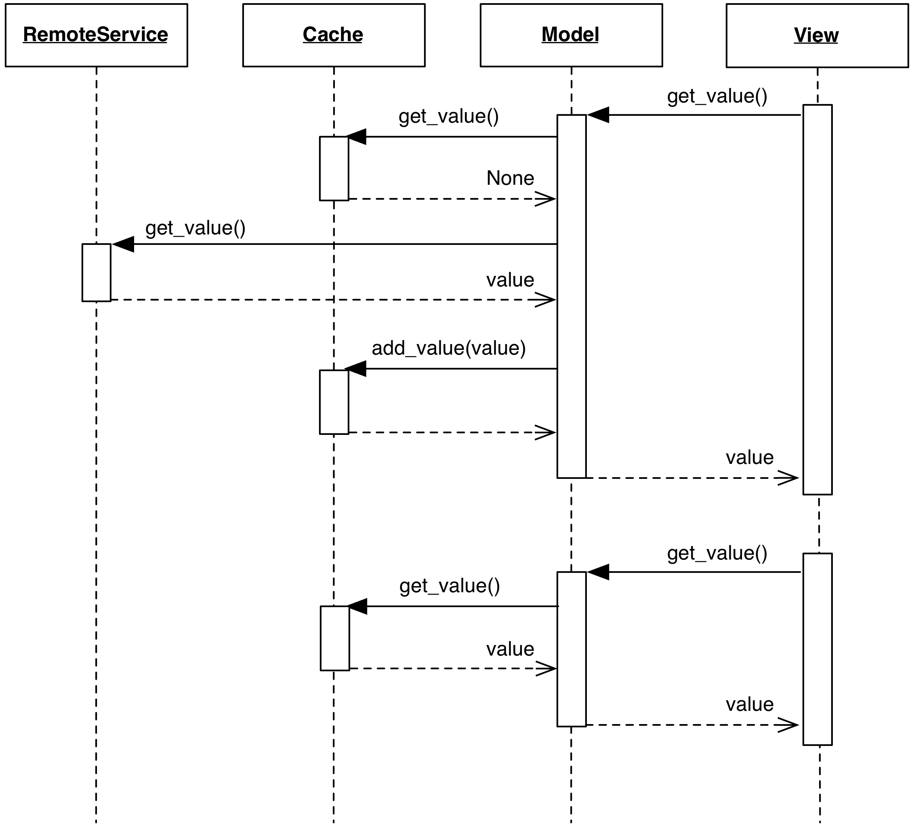

<!--- Done -->
# Caching Model

### Motivation

Models may want to cache information when acting as a proxy for 
data sources that are slow, unreliable, or have an access quota 
or cost. Typical examples are network services, databases, disk
access, or when the information is obtained from long-running 
computations.

Using a cache generally delivers the following advantages:

- Gives a faster response after the first access, improving 
  the perceived performance of the application
- Neutralizes potential temporary failures of the data source,
  improving perceived reliability
- When accessing a remote resource, prevents repeated and frequent 
  requests of the resource. Failure to implement caching in this case 
  generally leads to a security response from the administrators of the
  remote resource (e.g. throttling, or denied access).

However, caching comes with a set of liabilities:

- Increases memory footprint of the application to store the cached data
- The Model may return outdated information to its client
- In multi-user web-applications, cached data may contain critical security
  information, and must therefore not be leaked to unintended recipients.

### Design

The typical design of a Caching Model involves the following steps to
retrieve the data from a source:

1. The View attempts to retrieve some information from the Model.
2. The Model first attempts to obtain this information from the Cache.
3. If the desired information is not found, the Model will perform
   a query to the data source, obtain the result, add it to
   the Cache, and return it to the View.
4. Additional attempts to retrieve the same information from the Model
   will extract data from the Cache.

    

When parameters are passed during the ``get`` request, the cache must 
have an index over these parameters to guarantee a retrieval of the
intended information. For example, if a Model class ``UserRepository``
has a method ``get_user_data(user_id)``, this method must use the
parameter ``user_id`` to perform the intended retrieval from the cache.

To perform a ``set`` operation on the Model, two strategies are possible.
The first one is to apply the changing action on the slow data source, 
followed by either a similar update or an invalidation of the cached data.
This strategy has the following caveats:

- If the ``set`` action is expected to change the data source in 
  a non-trivial way, it may not be possible to perform a sensible 
  change to the cached data with the same business logic supported 
  by the remote source. Instead, one should remove the cached data 
  to promote a fresh retrieval at the next ``get`` operation. 
- The operation requires a round trip to the slow data source, with
  consequences both at the UI level (failures must be reported, in-progress
  operations need to present a sensible progress bar, perceived performance may
  suffer) and also at the application design level (if repeated ``set``
  operations are needed, performing a round trip to the data source every time
  is wasteful and impacts performance).

The second possible strategy is to update the cached data and postpone the 
data source update, possibly bundling multiple changes into a single
request. With this solution, the cache must not evict the changed information 
until it has been committed to the data source. Further issues may exist for
resources that are shared among clients, or in case of application crash or
network failure where the changed content is only partially submitted or not at
all. 

Clients of the Model may need to be aware of the existence of a cache if they
want to guarantee up-to-date data, or need to force flushing of changes to the
remote service.

### Caching strategies

Choosing an appropriate caching strategy is a complex topic 
well outside the scope of this book. Several factors may need to be kept into
account, such as data access patterns, specific requirements of the design 
and the application behavior, and data consistency.

To present a few among many possibilities, the most trivial strategy
is to simply perform memoization of the result. A Model using memoization
effectively uses a cache whose entries never expire. The cache size can be
kept under control by discarding the Least Recently Used (LRU) data.

LRU constraint the size of the cache and keeps the most recently 
used data, but does not provide a predictable expiration strategy,
something that may be required for some applications. For example,
a News Ticker application retrieving information from a website may want to
invalidate the cached data and perform a new retrieval, hopefully to obtain
updated information, after a fixed absolute timeout (e.g. 15 minutes).
Other applications may prefer a sliding expiration strategy: cached data expire
only if not accessed within a given amount of time (e.g. 5 minutes, but the
countdown resets to zero if requested again), or when an explicit method call
is issued on the Model object. Smarter strategies may use a small payload
request to ask the remote service if new or changed data are available, and act
accordingly by either retrieving the new data or return the cached information.

Additional optimizations that are frequently used are preemptive caching and priority caching.
Preemptive caching stores Model data that is likely to be accessed soon, even when not directly
requested. For example, while retrieving information about a given user from a
social networking website, a smart caching engine may decide to retrieve its
most recent pictures and populate the cache of the picture Model objects;
Priority caching allows to consider different levels of likelihood for
eviction, removing low priority before high priority data.

