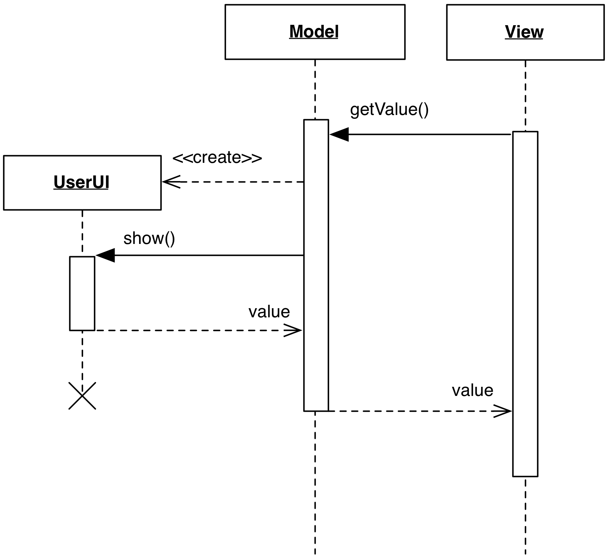

<!--- Done -->
# UI Retrieving Model

### Motivation

An important constraint about the Model that we stressed throughout the book
is that it should never be involved in GUI-related business. **UI Retrieving
Model** breaks this rule. 

Among a Model's task is the need to retrieve information from a data
source, such as a file, memory, or database. In some cases, the Model
may have to retrieve information that only a direct session with the User 
can provide. We can break the rules and let the Model create a UI dialog 
to inquire the User for this information. In other words, the Model 
consider the User as a database, whose API involves the use of graphical widgets.

### Design

The interaction diagram design of a UI retrieving Model is depicted in Figure

<p align="center">
    
</p>

The core of the design is the short-lived ``UserUI`` object. In its most 
basic form this object is a modal dialog, prompted to the User and 
awaiting for input. The modal nature of the dialog guarantees 
a synchronous handling of the operation.

Once the dialog is closed, the value is gathered and returned 
to the requesting client. Depending on the nature of the retrieved 
information, it might be useful for the Model to cache it instead 
of prompting the User again.

### Practical example

One trivial example of this pattern would be a Model object representing
the User session, with a password field initially set to ``None``. When the
program starts the session, it will ask for the credentials to the Model layer.
Asking the username will return the proper string, but asking the password may
return None if no password has been set yet. The Model is then authorized
to retrieve this information from the User by a GUI dialog, maybe trying
some non-interactive strategies first, like checking in a configuration file.

```python
class Model(object):
    def get_password(self):
        if self._password is None:
            password, ok = QtGui.QInputDialog.getText(
                None, 
                "Please input your password", 
                "Password:", 
                QtGui.QLineEdit.Password)                                                
            
            if ok:
                self._password = password
                
        return self._password    

    def clear_password(self):
        self._password = None
```

When the user acts on the dialog, the Model stores the password and returns
it to the Presenter layer, which then proceeds with the authentication logic if
the result is a string. If the password is found to be incorrect, the Controller 
will ask the Model to ``clear_password()``, and the user will be prompted again.
