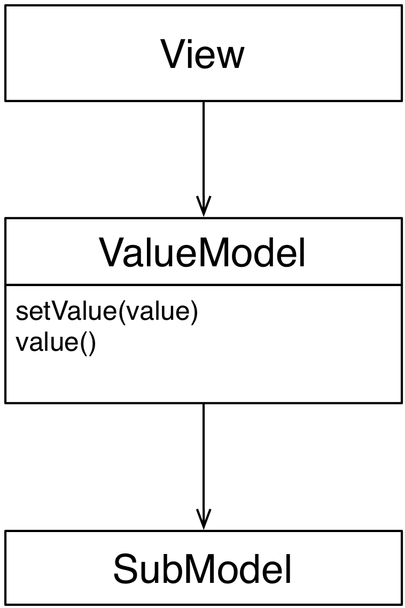

<!--- Done -->
# Value Model

### Motivation

A Value Model is an Adapter class extracting a single value from an adaptee (SubModel).
The extracted value is exposed thought a uniform and trivial interface: a getter 
``ValueModel.value()``, a setter ``ValueModel.set_value()``, and notification. 

Views and Controllers using a Value Model can be extremely simple and
off-the-shelf, provided that they can handle the Value Model interface. 
They can ignore the nature of the adapted SubModel, leaving to the Value 
Model the responsibility of taking care of the details.

### Design

The Value Model class acts as an adapter

<p align="center">
    
</p>

A trivial implementation of a Value Model would be:

```python
class ValueModel(Model):
    def __init__(self, sub_model):
        self._sub_model = sub_model
    
    def set_value(self, value):
        # do potentially complex logic on self._sub_model
        # to appropriately manipulate the passed value
        # This method triggers a self.value_changed notification.
        
    def value(self):
        # do potentially complex logic on self._sub_model
        # to extract a single value
    
```

Many different Value Model classes can be implemented, each one
adapting a different SubModel, or operating over different parts of a SubModel.
Views and Controllers interact with the Value Models through the minimalist interface, 
and are therefore agnostic of the Value Model used.

### Practical Example

One could adapt a ``Customer`` object through two Value Models: ``NameValueModel`` and ``SurnameValueModel``. 

```python
class NameValueModel(Model):
    def __init__(self, customer):
        self._customer = customer
    
    def set_value(self, value):
        self._customer.name = value
        self.notify_observers()
        
    def value(self):
        return self._customer.name
        
class SurnameValueModel(Model):
    def __init__(self, customer):
        self._customer = customer
    
    def set_value(self, value):
        self._customer.surname = value
        self.notify_observers()
        
    def value(self):
        return self._customer.surname
```

Each of these two ValueModels can use an off-the-shelf 
``StringWidget`` View, agnostic of the actual nature of the 
``Customer`` model and retrieving/modifying data through the 
Value Model interface.

