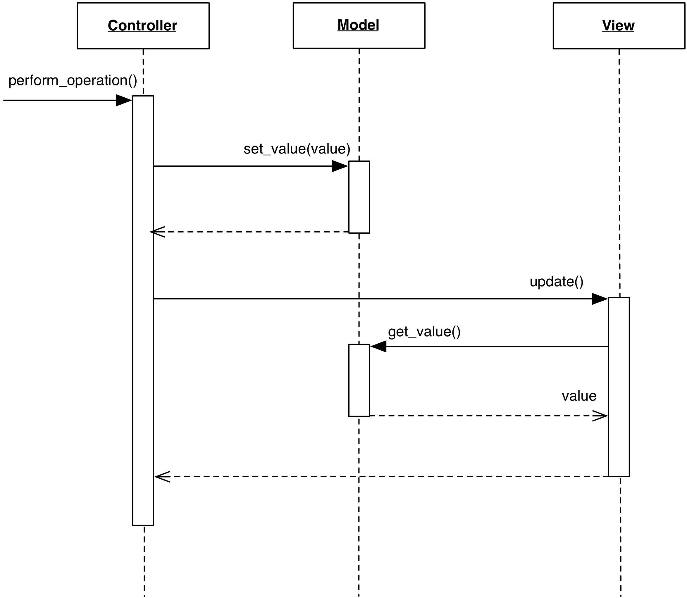

# Passive Model

### Motivation

Traditional MVC uses the so-called **Active Model**: when the Model changes its
listeners are notified of the change. Its counterpart is the **Passive Model**
which does not perform notification services. Instead, this task is performed
by the Controller.

Passive Model has its area of excellence in Web-based MVC, where the
fundamental nature of the HTTP protocol prevents the Model to 
notify the View. 

### Design

The interaction diagram shows the behavior of a Passive Model

<p align="center">
    
</p>

Specifically, the sequence of events is:

1. The Controller modifies the Model
2. The Controller informs the View to update itself
3. The View now inquires the Model contents as in the Active case.

The major shortcoming of a Passive Model is that Views get desynchronized
if multiple Controllers can modify the Model. Collaboration between Controllers
can prevent this desynchronization, but for all practical purposes an Active
Model quickly becomes a better solution. If this is required, a Passive Model
can become Active either through inheritance or by using a wrapper class
satisfying the Passive Model's original interface. This wrapper will receive
change requests from Controllers, delegate them to the Passive Model, and
finally notify the listeners. 

Despite the disadvantage, the Passive Model has the following important advantages: 

- Any object (e.g. a key-value dictionary, a list, a single value, a previously
  developed business object) can be used as a Model without modifications
- It allows better control on the refresh of the View. The Controller
  can issue multiple changes to the Model without triggering a View's refresh 
  for each change
- As commented in the Motivation section, Web-based MVC cannot use an 
  Active Model strategy due to the intrinsic separation of Models from 
  rendered Views.

### Code Example: Django MVC

The web framework Django is our choice to present a simple case of Passive
Model. Please note that this example is not meant to be considered orthodox
Django style, and has been stripped beyond the bare minimum to focus on the
relevant concept.

A Model in Django is specified as a python class with appropriate descriptors

```python
class Article(models.Model):
    title = models.CharField(max_length=200)
    text = models.CharField()
```

Being a Passive Model, notification is absent. The Controller negotiates the
View's refresh. In Django, the Controller is generally an entry point routine 
such as the following

```python
def modify_article(request, article_id):
    article = get_object_or_404(Article, pk=article_id)

    # These changes do not trigger any notification. The model is passive.
    article.title = request.POST["title"]
    article.text = request.POST["text"]

    # Persist the replaced data.
    article.save()

    return HttpResponseRedirect(reverse('article', args=(article.id,)))
```

The View is a HTML document that is displayed by the User's web browser, and is
returned by a different Controller routine

```
def get_article(request, article_id):
    # Render the View.
    template = Template("<html><body>"
                        "<h1>{{ article.title }}</h1>"
                        "<p>{{ article.text }}</p>"
                        "</body></html>")
    context = { "article" : article }
    html_doc = template.render(context)

    return HttpResponse(html_doc)
``` 

The Controller ``modify_article`` retrieves and modifies the ``article`` Model object.
Once the operation is completed, the Controller informs the View to retrieve the new data
through a HTTP redirection. This redirection invokes the ``get_article`` Controller, which 
renders the HTML document and returns it to the browser.

As an alternative solution, the ``modify_article`` Controller could perform both 
the Model change and the article rendering, "pushing" the updated View data to the
browser instead of asking to "pull" through the redirection to ``get_article``. 
The appropriate strategy might depend on browser-side choices.

### References

- [MSDN documentation: Model-View-Controller](https://msdn.microsoft.com/en-us/library/ff649643.aspx)
