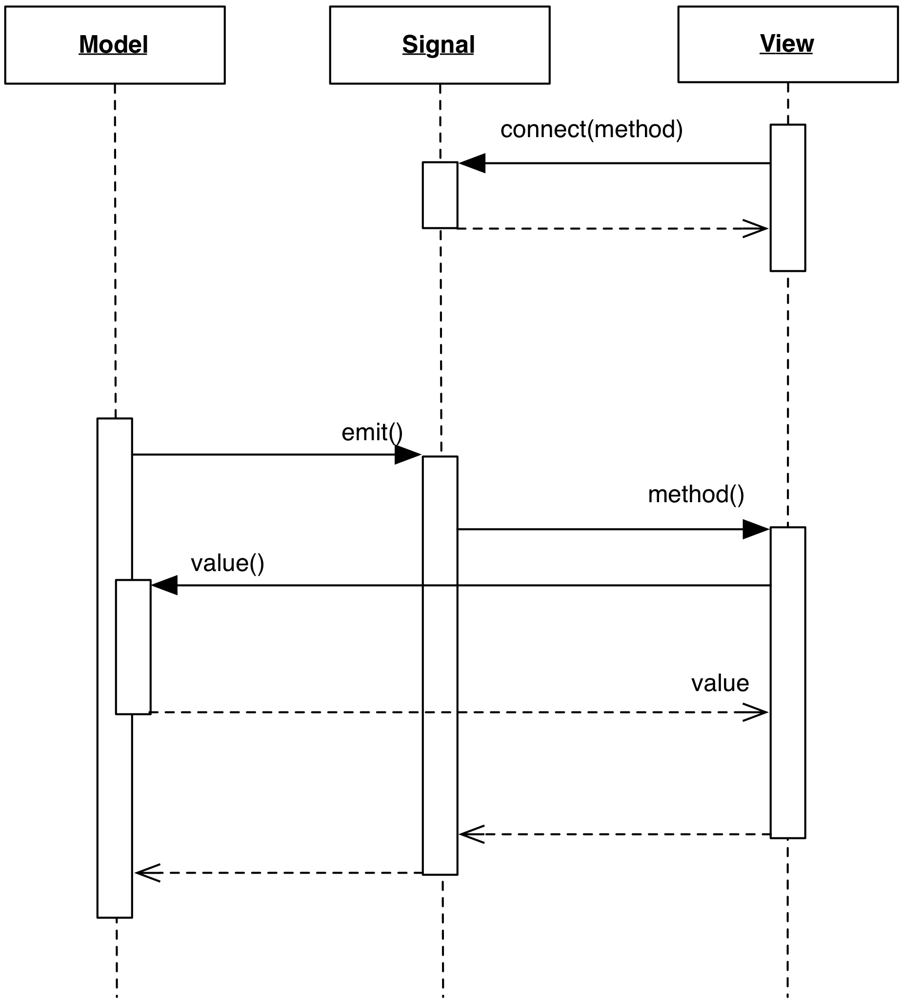

# Signals

### Motivation

A problem carried over from the traditional MVC approach is 
the need for the Model to hold a collection of its listeners
for notification purposes. This introduces a dependency between
the Model and the listener interface that all Views must 
implement.

The design presented in this section decouples this dependency
between Models and Views, extracting the Traditional MVC 
notification system in a separate object acting as an intermediary 
between the two. 

Althought not immediately apparent, the benefit of this new 
design are important: 

- Different Signals can represent different changes, providing the
  flexibility of a qualified notification.
- Signals can be made to call specific View's methods, instead of a
  generic `notify()`

### Design

A Signal class holds the notification infrastructure previously held by the Model:
a list of listeners, and methods for listeners to register and unregister. 
The Signal class also possess an ``emit()`` method, which triggers notification
to the registered listeners.

    

The Model defines its signalling capabilities by defining member variables
of type Signal. These member variables are given appropriate names to convey
the nature of each reported event. Each listener can subscribe to the signals
they are interested in.

When a change of the appropriate type occurs, the Model triggers the
notification by calling ``emit()`` on the signal object, which in turn
will notify each individual listener.

### Variations

A basic implementation just delivers the message to the listeners.
Increased flexibility can be obtained by allowing the passing of arguments
to the ``emit()`` method, allowing qualification of the emitted signal.

The Signal can be configurable and hold state. 
A better signal class could implement three strategies:

- open: the message is delivered as soon as triggered.
- closed: the message is not delivered and is ignored
- hold: the message is not delivered, but it is retained for later. 

### Practical examples

The most notable example of such infrastructure can be found in Boost.Signal2
which is as described. Boost.Signal2 allows registration of arbitrary methods
that are then when the signal is emitted. The emit functionality is implemented
through ``operator()``.

Another example of Signal design is Qt Signal/Slot mechanism, although the internals
do not make use of a literal Signal object.

With signals, you might have to adapt the signals that your model emits
to the specific needs of your views. 
A coarse grained signal that forces
a heavy refresh on the view may be better split into a separate signal
specific to the area of the model that actually affects the view. In 
practice, the model communication pattern may have to adapt to the View's
implementation details to guarantee responsiveness.

For example, if you have a view displaying the number of lines in a document,
subscribing to a contentChanged signal may require a recalculation of the number
of lines at every character inserted. It may make sense to provide a lineNumberChanged
signal, so that line number display is updated only when the model actually
performs a change in the total number of lines.

