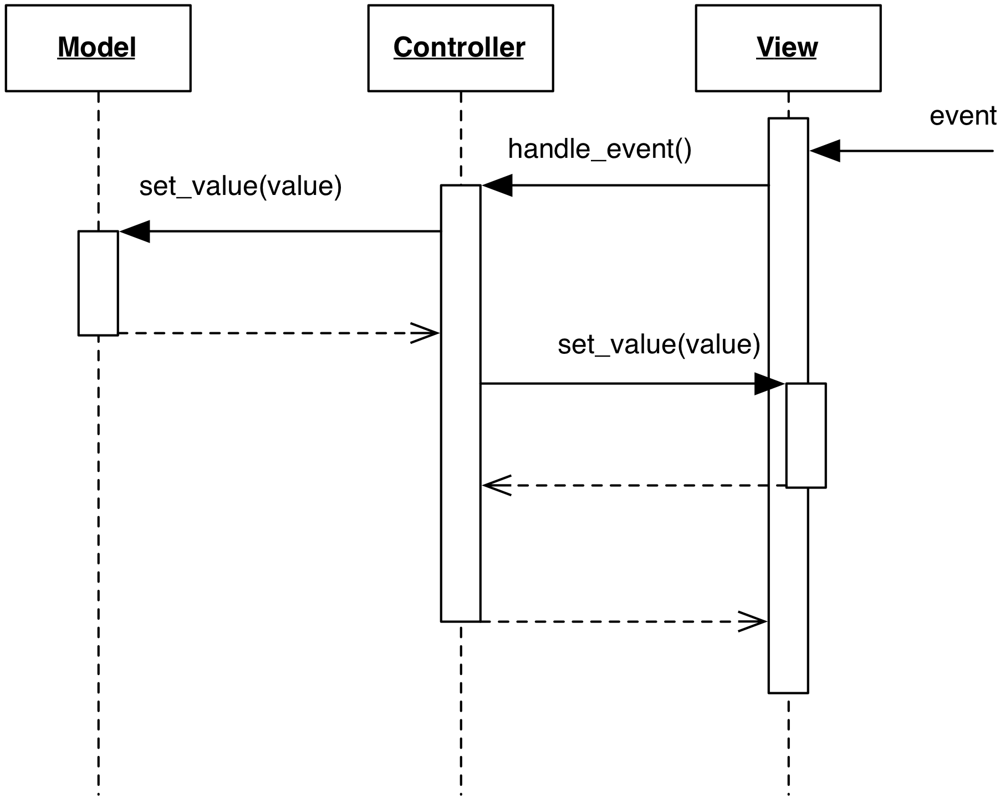

# Passive View

### Motivation

A major problem resulting from a complex View is the difficulty of testing.
Visual components tend to be more complex to test, because they might require
interaction. Toolkits provide techniques to create simulated events
programmatically, but their handling depends on the event loop being executed. 

The **Passive View** (also referred as **Humble Dialog** or
**Humble View**) approach eases testability by moving all logic from the
View to the Controller. This results in a View humble in logic and with 
no awareness of the Model. In fact, the View is not subscribed to Model changes,
and is not extracting data from it. It is instead the Controller's duty to 
push data into the View, which is made out of off-the-shelf widgets.

### Design

In a Passive View design, all business code goes in the Controller or the Model.
In particular, the Controller is now in charge of 
- visual logic (e.g. altering colors of widgets)
- visual semantics (interpreting the meaning of a button click), 
- data validation (checking if data from the View are correct, potentially with support
  from the Model) 
- synchronization of the View's contents, through the View's set/get methods.  

    

The mechanism of action is the following:

1. When the View receives user events, they are forwarded to the Controller
   as in Traditional MVC.
2. The Controller acts on the Model.
3. Either immediately (if Passive Model, in Figure), or in response 
   to a Model notification (if Active Model), the Controller updates 
   the data displayed by the View's widgets, synchronizing them against 
   the new Model contents.

With none of the logic in the View, testing is simplified. 
The View can be completely replaced with a mock object implementing the same
interface.  When testing the Controller, the mock View's methods will be
called, and their invocation can be checked by the test. 
The mock View can also be set up to present specific data to the 
Controller.
