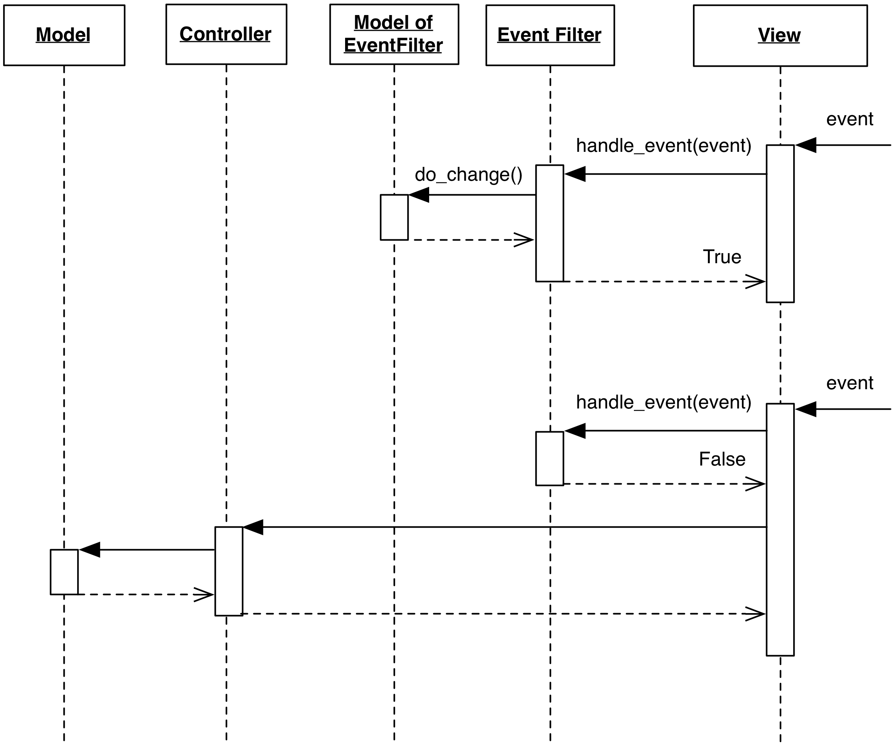

# Event Filter

### Motivation

An Event Filter is a special Controller that encapsulates redirection of the UI
event flow: it intercepts UI events before they are delivered to a specific
View. Once intercepted, events are interpreted and handled by the Event Filter,
which can perform specific actions or suppress the events completely so that
they never reach the View. 

### Design

Event Filters can be designed either as objects with a specific interface, or 
as function objects with a signature accepting the event.  They are generally
designed to be pluggable at runtime through an appropriate interface on the
View.  

Before being handled by the View, a UI event is dispatched to the View's
registered Event Filter, if present. The Event Filter is free to respond to the
event by acting on Models, Views or Controller objects which may or may not be
known by the View. Once the Event Filter completes its execution, 
it communicates to the View if the event should be processed as usual or not.
In the latter case, the View acts as if the event never occurred.

<p align="center">
    
</p>

From the interaction diagram:

1. Events are routed into the Filter by the View, through a ``handle_event(event)`` interface
2. The Event Filter can now recognize a specific event and perform operations on the
   Model it is connected to. 
3. If the Event Filter handles the event, The View is notified through either a flag on 
   the event class or a boolean return value for the ``handle_event()`` method. In the 
   case presented above, the latter strategy is used. The ``True`` return value implies
   that the event was handled by the Filter and should not be handled further by the View.
4. If ``EventFilter.handle_event()`` returns ``False``, the View handles the event as usual.
   Note that the Event Filter might choose to handle the event and still return ``False``, 
   allowing the View to operate as usual.

As a consequence of its design and purpose, the Event Filter must be dependent on
the UI, and must know how to handle the UI Event interface. 

### Practical Example

The Qt toolkit offers a clear example of an Event Filter. To define an
``EventFilter`` class, it is sufficient to use ``QObject`` as a base class,
implementing the method ``QObject.eventFilter()``.  This method will be
responsible for the processing of the events.  An instance of ``EventFilter``
is then installed onto a target object through ``installEventFilter()``.  Qt
implementation is very flexible, and allows any object to hold event filters,
not only UI components.

The following program illustrates the concept

```python
import sys
from PySide import QtGui, QtCore
app = QtGui.QApplication(sys.argv)

class EventFilter(QtCore.QObject):
    def eventFilter(self, receiver, event):
        print(type(receiver), type(event))
        return False
        
event_filter = EventFilter()
button = QtGui.QPushButton("hello")
button.installEventFilter(event_filter)
button.show()

app.exec_()
```

The example creates a `QPushButton` widget and installs an `EventFilter` instance on it.
UI events (mouse movements and clicks, key presses, show/hide, resize, repaint etc.)
that are meant for the `QPushButton` are first dispatched to `EventFilter.eventFilter()`,
then to the `QPushButton` if and only if the `eventFilter` method returns `False`.
