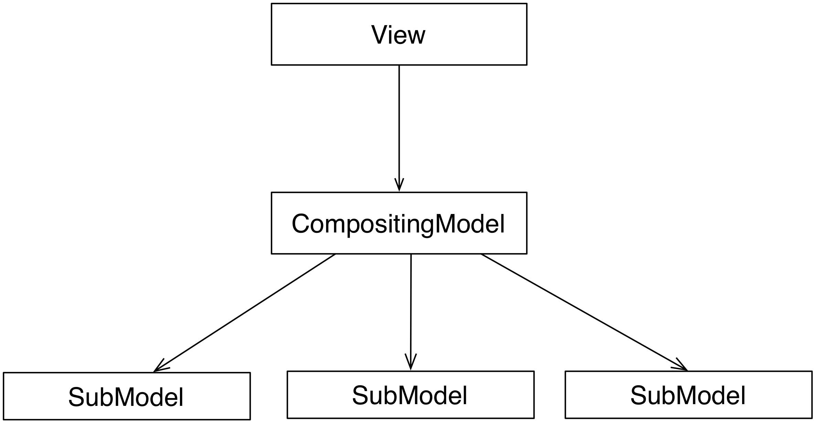
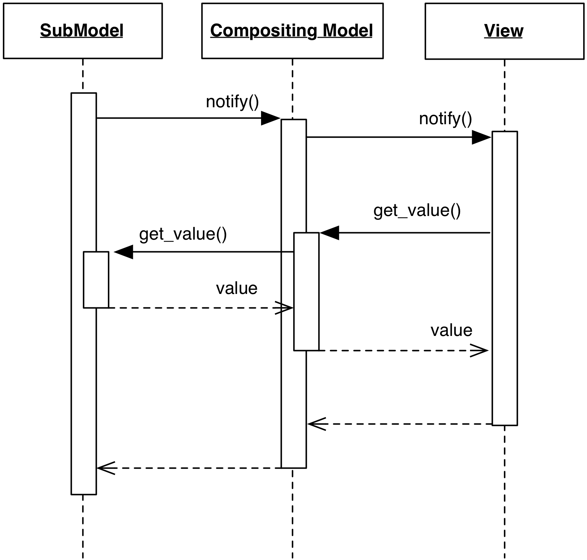

# Compositing Model

### Motivation

A Compositing Model aggregates data from multiple Model objects so that the
View has a single and uniform point of access for its data source. 
Two different sub-types of a Compositing Model exist, each addressing
a different use cases:

- A **Union Compositing Model** performs union of homogeneous data originating 
  from different sources. For example, a Union Model can present data from
  multiple files, each handled by a SubModel.
- A **Join Compositing Model** extracts and combines relevant 
  information from heterogeneous Models and provides a convenient
  interface to the result. For example, a `CustomerHistory` 
  Model could combine Models `Customers` and `Orders`, returning 
  the combined information to the View.

### Design

The Compositing Model acts both as listener and notifier. It holds references 
to its SubModels, and registers onto them as a listener.  Its life cycle can be
temporary and disjoint from the life cycle of its SubModels.

<p align="center">
     
</p>

Notifications from individual SubModels are received and re-issued by the
Compositing Model to notify the View. Vice-versa, data requests issued by 
the View on the Compositing Model are routed to the appropriate SubModel. 

<p align="center">
     
</p>

By its very nature, the Compositing Model is expected to be the only endpoint
for a specific View, at least for data retrieval. The Controller, on the other hand,
can either:

- issue change requests on the Compositing Model, which in turns forwards the 
  change request to the appropriate SubModel according to some criteria. 
  The Compositing Model is therefore acting as a surrogate Controller
- issue change requests directly on any of the Submodels. The SubModel will then issue 
  the notification, which is forwarded to the View by the Compositing Model.

It is worth pointing out that nothing prevents other Views (or Controllers) to
interact directly with any of the SubModels.

The above design considerations are common between the Union and the Join Compositing
Models. The most substantial difference between them is in their interface.
Union Models generally have the same interface as their SubModels, and Views
can display either of them transparently. Join Models, on the other hand,
likely provide a different interface to derived data, and the View is designed
to target only this interface.

### Practical example

A practical example of the Union Compositing Model for an AddressBook application
is here presented. The ``AddressBook`` class aggregates a list of SubModels,
each extracting data from a different file source:

```python
csv1_model = AddressBookCSV("file1.csv")
xml_model = AddressBookXML("file.xml")
csv2_model = AddressBookCSV("file2.csv")

address_book = AddressBook([csv1_model, xml_model, csv2_model])
```

A naive implementation for ``AddressBookCSV`` is here shown to illustrate its
interface. The common base class ``Model`` provides notification services
by implementing ``register``, ``unregister``, ``notify_listeners``, and the
listeners set

```python
class AddressBookCSV(Model):
    def __init__(self, filename):
        super(AddressBookCSV, self).__init__()
        self._filename = filename

    def num_entries(self):
        try:
            return len(open(self._filename, "r").readlines())
        except:
            return 0

    def get_entry(self, entry_number):
        try:
            with open(self._filename, "r") as f:
                line = f.readlines()[entry_number]
                name, phone = line.split(',')
                return { 'name' : name.strip(), 'phone' : phone.strip()}
        except:
            raise IndexError("Invalid entry %d" % entry_number)

    def append_entry(self, name, phone):
        with open(self._filename, "a") as f:
            f.write('{},{}\n'.format(name, phone))

        self.notify_listeners()

```

The ``AddressBook`` class is a Union Compositing Model implementing the same interface
of the SubModels

```python
class AddressBook(Model):
    def __init__(self, sub_models):
        super(AddressBook, self).__init__()

        self._sub_models = sub_models

        for m in self._sub_models:
            m.register(self)

    def num_entries(self):
        return sum([m.num_entries() for m in self._sub_models])

    def get_entry(self, entry_number):
    
        accumulated = itertools.accumulate(
            [m.num_entries() for m in self._sub_models])

        source_idx = [x <= entry_number for x in accumulated].index(False)

        return self._sub_models[source_idx].get_entry(
                               entry_number - accumulated[source_idx])

    def append_entry(self, name, phone):
        self._sub_models[-1].append_entry(name, phone)
       
    def notify(self):
        self.notify_listeners()
```

The class accepts an arbitrary number of SubModels at initialization, and
registers as a listener on each of them. It implements the same interface,
retrieving data from the SubModels: the number of entries is the sum of the
SubModel entries, and the ``get_entry`` method returns the entry from the 
appropriate SubModel. ``append_entry`` is used to add a new entry to the models.
In this case, the new entry is added to the last SubModel. Note how the
issuing of the notification is left to the SubModel. The notification from the
SubModel is then forwarded by the Compositing Model it to its listeners.

