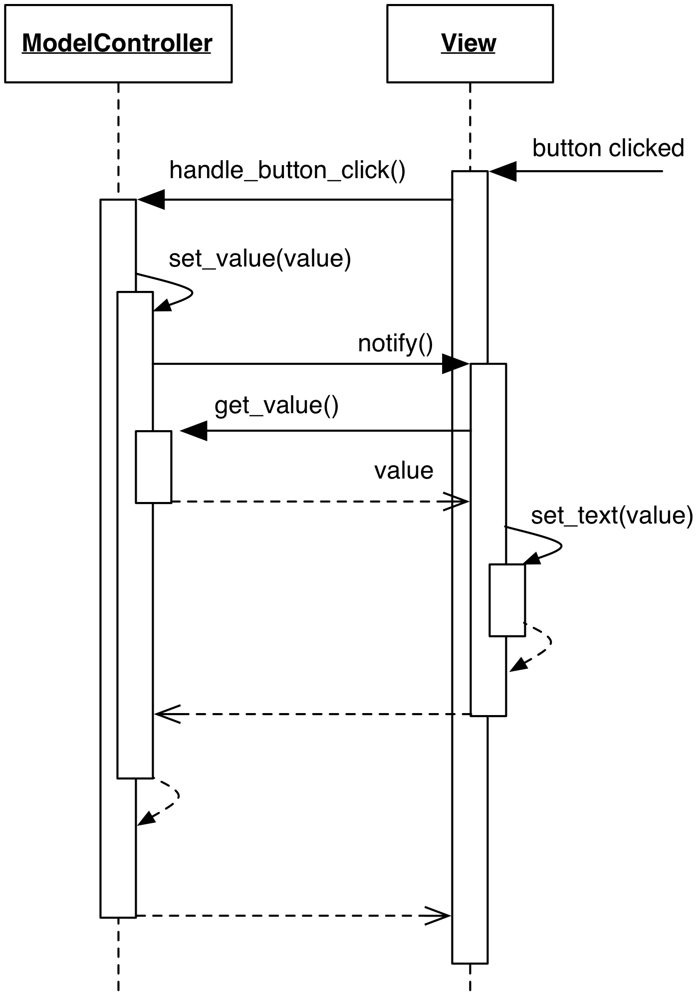

# ModelController

### Motivation

In some implementations, Model state may be small and only relevant 
for a specific View, making the split between Model and Controller 
classes excessive. Merging these classes leads to a **ModelController**, 
which can be seen as a "Model with GUI intelligence", or as a "Controller 
with state". 

Compared to a traditional MVC solution, ModelController has the following
disadvantages:

- As stated in the opening paragraph, it complicates handling of 
  multiple Views
- Potentially carries a dependency against the UI layer if, 
  for example, needs to interpret pure UI events. This complicates
  its reuse outside of a UI application
- It is generally less flexible, less reusable, and more complex to test for
  the reason give above.

The motivation for the first point is twofold: first, the Controller 
part would have to differentiate which View is sending an event. Second,
different Views may have a different visual implementation and thus generate
different types of events. The ModelController interface would have to
accommodate nomenclature and behavior of all Views, leading to a bloated and
complex interface.

A ModelController approach is not necessarily wrong, but tends to become
brittle and carry excessive responsibility. It is therefore limited to 
straightforward cases.

### Design

ModelController hosts the logic to manipulate its internal state 
in response to UI events, applying both consistency and business logic,
while at the same time handling events from the View:

- The View dispatches UI events to the ModelController
- The ModelController alters its state and notifies the View of changes
- The View requests the new state from the ModelController and updates itself.

<p align="center">
    
</p>

### Practical example

Trivially, a ModelController class holds state, instead of delegating it
to a Model object

```python
class ModelController(Model):
    def __init__(self):
        self._value = 0

    def button_pressed(self):
        self._value += 1
        self.notify_listeners()
```

This pattern can be observed, for example, in Enthought Traits

```python
from traits.api import *
from traitsui.api import *

class ModelController(HasStrictTraits):
    value = Int(0)
    increment_btn = Button()

    traits_view = View(
        Item("value"),
        UItem("increment_btn", label="Increment"),
        )
    
    def _increment_btn_fired(self):
        self.value += 1


mc = ModelController()
mc.configure_traits()
```

The above code, thanks to the Traits/TraitsUI framework, produces a window containing an editable text field
(showing the value zero) and a PushButton. Every time the button is pressed, the ``_increment_btn_fired`` handler
is called. By design of the class and the framework, the class is a ModelController because it holds
both Model state (``value``) and Controller duties (``_increment_btn_fired``). 
Although invisible, validation logic is also performed in the ModelController by the Traits framework,
which rejects values in the text field not conforming to an integer. 
