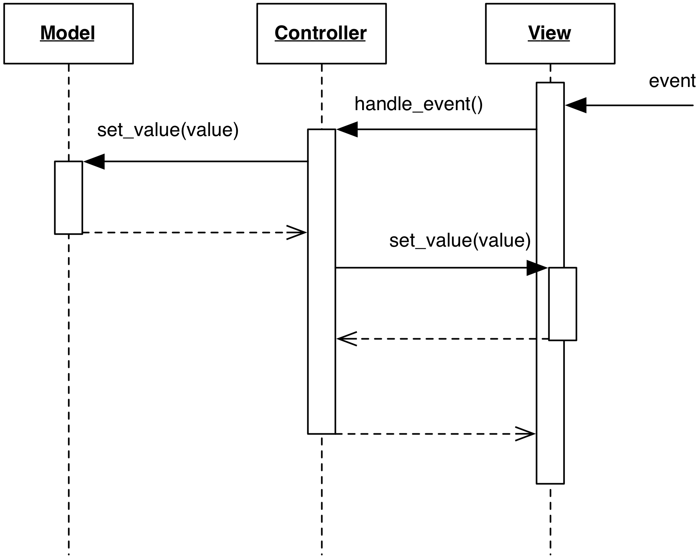

# Passive View

### Motivation

A major issue arising from a complex View is automated testing. 
Visual components require User interaction, which depends on 
the creation of events programmatically and the execution of an event loop
to dispatch them. Both requirements may present challenges.

The **Passive View** (also referred as **Humble Dialog** or
**Humble View**) eases testability by moving all View logic from the
View to the Controller. This results in a View humble in logic and with 
no awareness of the Model. In fact, the View is not subscribed to Model changes,
and is not extracting data from it. It is instead the Controller's duty to 
push data into the View, which is assembled from off-the-shelf widgets.

### Design

In a Passive View design, all logic goes in either the Controller or the Model.
In particular, the Controller is in charge of 
- Visual logic (e.g. altering colors of widgets)
- Visual semantics (interpreting the meaning of a Button click)
- Data validation (checking if data from the View are correct, potentially with support
  from the Model) 
- Synchronization of the View's contents, through the View's accessor methods.

The following interaction diagram shows the central role of the Controller 
in the synchronization, and the lack of interaction between the View and the Model.

    

which can be explained as follows:

1. When the View receives user events, they are forwarded to the Controller
   as in Traditional MVC
2. The Controller acts on the Model
3. Either immediately (if Passive Model, in the Figure), or in response 
   to a Model notification (if Active Model), the Controller updates 
   the data displayed by the View's widgets, synchronizing them against 
   the new Model contents.

The View is empty of logic, and can be completely replaced with a mock object 
implementing the same interface. When testing the Controller, the mock View's
methods will be called, and their invocation can be checked by the test. 
The mock View can also be set up to present specific data to the Controller, 
simulating User input.
