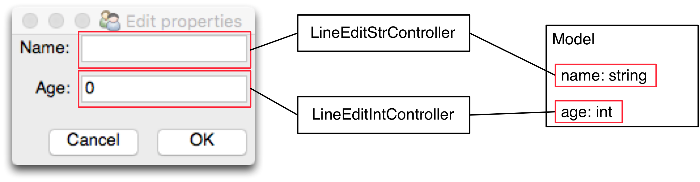

# Widget-level vs Container-level MVC

### Motivation

In our previous exploration we defined Views without any detail on the
scope of their implementation. Given a window containing a dozen of widgets, 
two implementations of the View object are possible:

- The View is the full window, forming a single MVC Triad through a complex,
dedicated Controller, or
- Each widget is considered a View. There are multiple independent 
triads, one per each widget.

Both approaches are possible, and they are called **Container-level** and 
**Widget-level MVC**, respectively. 

Each solution has advantages and disadvantages, and the consequence is that 
a mixture of both approaches is used: Widget-level has the strong
advantage of reusability. Views are off-the-shelf UI widgets, and Controllers
are generic classes tailored to specific widgets. The connection between the
widget and the Model property become straightforward, albeit prone to produce
boilerplate code to set up the connection. With some additional support, the
boilerplate can be eliminated, leading to the design known as Data Binding.
For this reason, widget-level MVC is the most frequently used building block 
because of its strong off-the-shelf nature.

On the other hand, a Container level approach is useful when there's need for a
specialized Controller handling multiple Models and their data's cross
validation, and for a View that acts as a container of complex SubViews. 

### Design

A Widget-level design requires one specific controller for each Widget of the 
toolkit. The role of each Controller is to handle the communication and data
conversion between the widget and a specific property of the Model, and vice-versa.
In particular, the Controller must push changes onto the Widgets, which behave as 
Passive Views.

    

Considering that Model properties can have different types, a strategy for correct type 
handling may be required as well. This gives raise to a potentially large set of 
controllers for all the possible combinations widget/model type (e.g. 
``ListEditStrController``, ``ListEditIntController``, and so on). 
An alternative approach is to have only per-widget controllers (``ListEditController``)
which accept a type conversion strategy as a conversion function. Introspection
is then performed on the Model property to determine its type, followed by a lookup of the 
appropriate conversion strategy from the View representation (e.g. a string) to the actual 
Model type (e.g. an int).

Synchronization between Model and Widget is generally bi-directional:
if the Model changes, the Widget will update (Model to Widget), and if the
Widget is updated by the User, the Model will change (Widget to Model). There are 
however cases where one-directional communication is preferrable:
"Model to Widget" only is the reasonable choice when the Widget is read-only.
"Widget to Model" only is instead used when coercion of the type introduces
bounceback from the Model. This particular problem will be explored in more
detail later (see Coercion Bounceback).

### Practical example

is better explained with a practical example
supporting the explanation: a window contains a LineEdit widget to write a 
message and a "Send" button to send the message. The resulting design will have 
two widgets (LineEdit and Button, each of them a View), two specialized 
Controllers (LineEditController and ButtonController) and a single Model.

: a generic LineEdit could be connected to
a Model string variable via a LineEditStringController, or to a float variable
via a LineEditFloatController. The Controller would take care of validating and
converting the data type (for example, from the string provided by the LineEdit
to a float)

but it introduces the following shortcomings:
- The controller may be too trivial in some cases, in particular with complex
Models (e.g. multiple instances must be handled) or complex Views (e.g.
different widgets that need to be analyzed by the controller at the same time).

