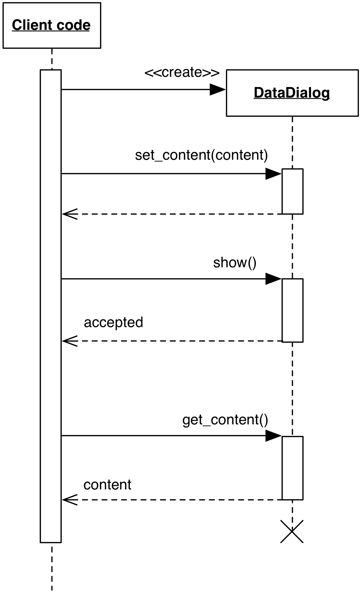

# Data Dialog

### Motivation

Data Dialog is a simplified and practical design to retrieve information from the User
by means of a modal dialog. It is generally used to retrieve preference information.

To use a Data Dialog, the following constraints must be respected:

 - It must be Modal (i.e. when visible, interaction with the rest of the application is prevented)
 - It only allows Accept (``Ok`` button) and Reject (``Cancel`` button) operations, not Apply
 - It does not need to synchronize with the application state while visible.

Data Dialog is different from Local Model. A Local Model is a real Model that is 
connected to the View through notification, but has simply been copied to preserve 
its initial state if changes are reverted. Data Dialog, on the other hand, is simply 
a View with an API to populate or retrieve information from its widgets in
a trivial representation.

### Design

Data Dialog object is instantiated, and its widgets are populated through an 
appropriate method call ``set_content``. Data is passed in a trivial representation 
(*e.g.* a properly keyed dictionary) as an argument of this method.

<p align="center">
    
</p>

The dialog is then shown to the User. As explained in the Motivation, the ``show`` 
operation must block and produce a modal dialog. The User can interact with it
and modify the presented values. Basic validation can be performed and reported. 

Eventually, the User will issue either an "Ok" or "Cancel". With an "Ok", the new 
data is gathered from the Dialog through a ``get_content`` method returning the
same trivial representation. The client code will then process this 
information appropriately. If the User issues a "Cancel", the gathered information 
is simply discarded.

Testability of the Data Dialog itself is potentially complex due to its synchronous nature.
Client code however can replace Data Dialog with a mock honoring the same interface,
resulting in easier testability of this part of the application.


### Practical Example

The following example with Qt will show the main concept outlining Data Dialog.
Both idiomatic python and Qt have been ignored to favor clarity, as usual.

The ``DataDialog`` class implements a Dialog with textual fields, an Ok and Cancel buttons.

```python
class DataDialog(QDialog):
    def __init__(self, parent=None, flags=0):
        super(DataDialog, self).__init__(parent, flags)
        self._line_edits = {}
        self._data_fields = ["name", "surname", "age"]

        layout = QGridLayout()
        for row, field in enumerate(self._data_fields):
            layout.addWidget(QLabel(field), row, 0)

            line_edit = QLineEdit()
            layout.addWidget(line_edit, row, 1)

            self._line_edits[field] = line_edit

        ok = QPushButton("Ok")
        cancel = QPushButton("Cancel")
        self.connect(ok, SIGNAL("clicked()"), self.accept)
        self.connect(cancel, SIGNAL("clicked()"), self.reject)
        layout.addWidget(cancel, len(self._data_fields), 0)
        layout.addWidget(ok, len(self._data_fields), 1)

        self.setLayout(layout)
```

The core of the design resides in the ``set_content/get_content`` pair:
``set_content`` accepts a dictionary with appropriate data for the dialog
fields, and fills the widgets with its contents. ``get_content`` retrieves
the data from the widgets and returns them as a dictionary to the client code.

```python
class DataDialog(QDialog):
    # <...>
    def set_content(self, data):
        for field in self._data_fields:
            line_edit = self._line_edits[field]
            if field in data:
                line_edit.setText(data[field])

    def get_content(self):
        data = {}
        for field in self._data_fields:
            line_edit = self._line_edits[field]
            data[field] = line_edit.text()

        return data
```

The client code interacts with the dialog by setting and retrieving the
data through these two methods:

```python
data = {"name": "Albert",
        "surname": "Einstein",
        }

data_dialog = DataDialog()
data_dialog.set_content(data)

if data_dialog.exec_() == QDialog.Accepted:
    print("Dialog Accepted. Content:")
    print(data_dialog.get_content())
else:
    print("Dialog Canceled.")
```


