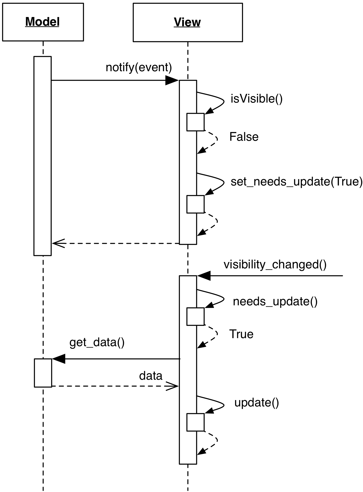

# Visibility Allowed Notification

### Motivation

Views that are hidden to the User generally do not need to react to notifications
from the Model: depending on the nature of the View and the optimizations of the
UI toolkit used, this can result in performance degradation from mild to severe. 
Machine cycles can be saved by ignoring the notification altogether, according to
the visibility status. 

One possible approach to this optimization is to unsubscribe the View from the 
Model when hidden, and re-subscribe when shown. This option requires some 
bookkeeping, and is generally less appealing than the alternative:
to simply interrupt further processing of the notification when the View is hidden.
When the View becomes visible again, synchronization with the Model must occur, 
but only if an actual change has taken place. Failure to do so would slow down the
return of the View without reason.

### Design

<p align="center">
    
</p>

When a notification is delivered to the View, the View checks for its visibility.
If not visible, it simply sets a `needs_update` flag.

When the View is made visible again, and assuming the View preserves
its visual state even when hidden, the `needs_update` flag is checked. 
If the flag is set, the View resynchronizes against the Model contents,
otherwise, it just presents the old visual appearance.

### Practical Example

Implementation of this feature is trivial:

```python
    def notify(self):
        if not self.isVisible():
            self.needs_update = True
            return

        self.refresh_from_model()

    def showEvent(event):
        if self.needs_update:
            self.refresh_from_model()
            self.needs_update = False

        super().showEvent(event)
```

We resync against the Model in ``refresh_from_model``. This method is called at
``showEvent()``, the Qt method for handling widget show events. We save an
additional resync against the Model by explicitly checking for the
``needs_update`` flag.

The ``notify()`` method called by the Model checks visibility first and sets
the ``needs_update`` flag if the window is not visible, saving a
``refresh_from_model`` call.
        
            
