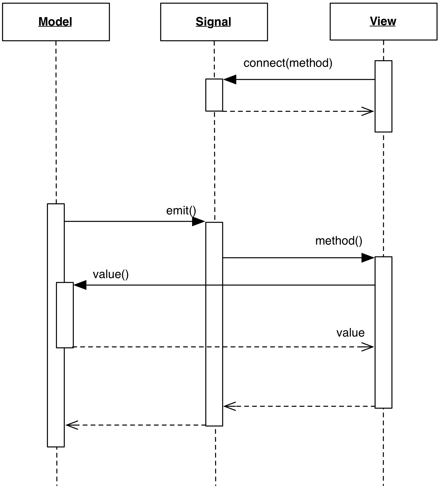

# Signals

### Motivation

A problem carried over from the traditional MVC approach is 
the need for the Model to hold a collection of its listeners
for notification purposes. This introduces a loose dependency 
between the Model and the listener interface that all Views 
must implement.

The design presented in this section decouples this dependency
between Models and Views, extracting the notification system in 
a separate object, the Signal, acting as a relay between the two. 
Althought not immediately apparent, the benefits of this approach 
are important: 

- Different Signals can represent different changes, providing the
  flexibility of a Qualified Notification.
- Signals can be made to call specific View's methods, instead of a
  generic ``notify()``, passing specific arguments.

### Design

A Signal class holds the notification infrastructure previously held by the Model:
a list of listeners and methods for listeners to register and unregister. 
Notification to listeners is triggered via a ``Signal.emit()`` method.

<p align="center">
    
</p>

The Model defines its signalling capabilities by exposing member variables
of type Signal. These member variables are given appropriate names to convey
the nature of each reported event. Listeners subscribe to the signals
they are interested in.

When a change of the appropriate type occurs, the Model triggers the
notification by calling ``emit()`` on the Signal object, which in turn
will notify each individual listener.

### Variation: additional flexibility to notification

A basic implementation just notifies the listeners.  Increased flexibility can
be obtained by allowing the passing of arguments to the ``emit()`` method,
allowing further qualification of the emitted signal.

The Signal can be made configurable in its functionality.  A Signal class could
for example implement three strategies for notification:

- open: the notification is performed as soon as triggered.
- closed: the notification is silenced.
- hold: the notification is not delivered, but it is retained for later (i.e. an Accumulator-like behavior)

### Practical examples

A Signal implementation conforming to the above design can be found in Boost.Signal2. 
In the following example, we demonstrate the registration of an arbitrary method
``print_sum`` to a Signal object and its execution when the signal is emitted. 
The ``emit`` functionality is implemented through ``operator()``. Note how
parameters can be passed to the connected functions.

```c++
void print_sum(float x, float y) {
    std::cout << "The sum is " << x + y << std::endl;
}


void main() {
    boost::signals2::signal<void (float, float)> sig;

    sig.connect(&print_sum);

    // emit
    sig(5., 3.);
}
```

Another example of Signal design is Qt Signal/Slot mechanism, although the internals
do not make use of a literal Signal object, and the mechanism requires the support from
a special preprocessor

```c++
class Model : public QObject
{
    Q_OBJECT

public:
    Model() { value = 0; }
    int value() const { return value; }

public slots:
    void setValue(int new_value) {
        if (new_value != value) {
            value = new_value;
            emit valueChanged(new_value);
        }
    }

signals:
    void valueChanged(int new_value);

private:
    int value;
};
```

The special signal ``valueChanged()`` is emitted every time a new value is set. Receiving
objects can subscribe to the Signal and guarantee synchronization

```c++
Model *model1 = new Model()
Model *model2 = new Model()
QObject::connect(model1, SIGNAL(valueChanged(int)), model2, SLOT(setValue(int)))
model1->setValue(42)
```

In the above code, ``model2->setValue`` will be called when model1 ``valueChanged`` signal is
emitted. This will synchronize the two objects to hold the same value.


### Practical example variation: notifying Views

One important feature of Qt signals is that they are not only found on Models,
but also on Widgets and Views. Buttons, for example, emit a ``clicked()``
Signal when clicked. Signals can therefore be used as a generic notification
mechanism applicable to any context where decoupling is desired.
