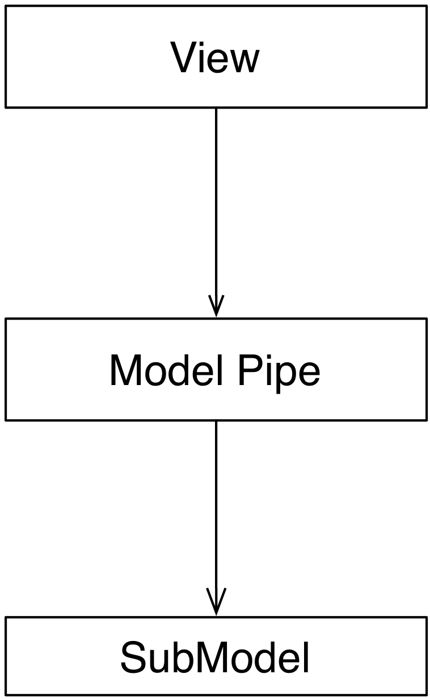
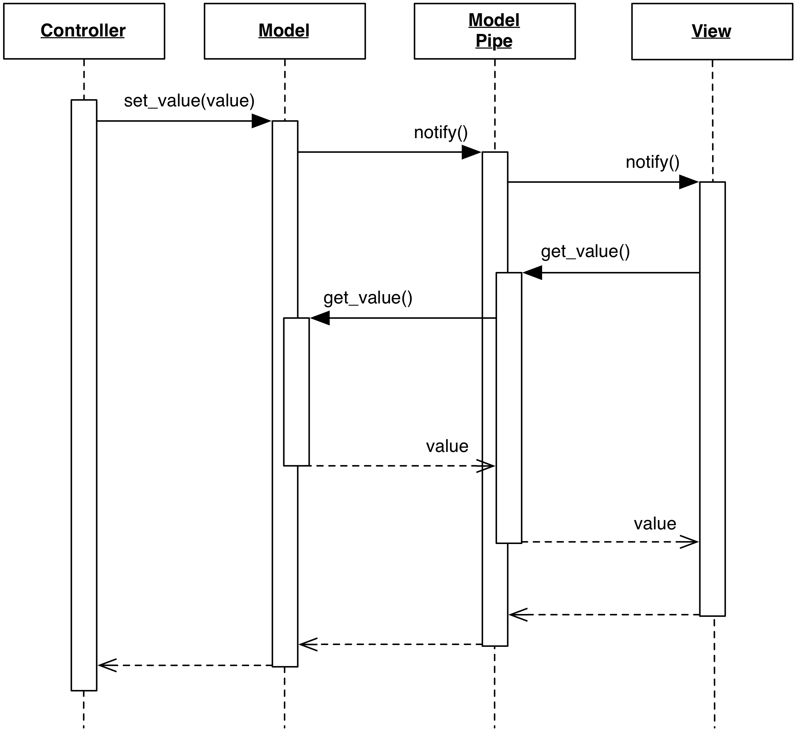

<!--- Done -->
# Model Pipe

### Motivation

The **Model Pipe** is a variation similar in concept to a UNIX pipe: it
intercepts and manipulates the data flowing from Model to View. Like in a UNIX
pipe, Model Pipes with different manipulation logic can be chained together to
perform sequential alteration of data.  Typical application of Model Pipe are
for filtering and sorting.

### Design

The Model Pipe encapsulates data transformation logic in a dedicated,
reusable class. Different Pipe classes can be created, each
with specific capabilities. 

<p align="center">
    
</p>

To be compatible with the View, a Model Pipe implements the same interface 
of the SubModel, eventually extending it to provide access to additional state 
it might contain. For example, a filtering Model Pipe will host data about the
current filter string. Controllers acting on the Model Pipe act on this state. 

The Model Pipe is a listener of the SubModel and forwards its events. In
addition, it performs notification when its internal state changes in a way
that modifies the resulting data.

<p align="center">
    
</p>

while the manipulation of the SubModel's data is performed directly on the
SubModel itself. 

### Practical Example: Qt QSortFilterProxyModel

Qt provides a Pipe Model with sorting and filtering functionality:
``QSortFilterProxyModel``.  It is worth noting that Qt calls this Model "Proxy
Model", but in the context of this book, Proxy Model refers to a different
Model design.

The following code sets up a Pipe Model connection between ``MyModel`` (our
implementation of ``QAbstractItemModel``) and a Tree View.  The Tree View
observes the Pipe Model, which in turns uses ``MyModel`` as a data source.

```python
tree_view = QTreeView()
model = MyModel()
pipe_model = QSortFilterProxyModel()
pipe_model.setSourceModel(model)
tree_view.setModel(pipe_model)
```

The Model Pipe provides an appropriate interface to configure the filter, such as
``setFilterRegExp``, and mapping routines ``mapToSource()`` and ``mapFromSource()`` 
to convert between index of an Item in the Model and index of that Item 
in the View. 

Note how the `tree_view.setModel()` accepts a ``QAbstractItemModel``, which is
implemented by both ``MyModel`` and by ``QSortFilterProxyModel``. As explained
earlier, this design allows the View to accept either Model, and remain unaware
of the existence of the pipeline.
