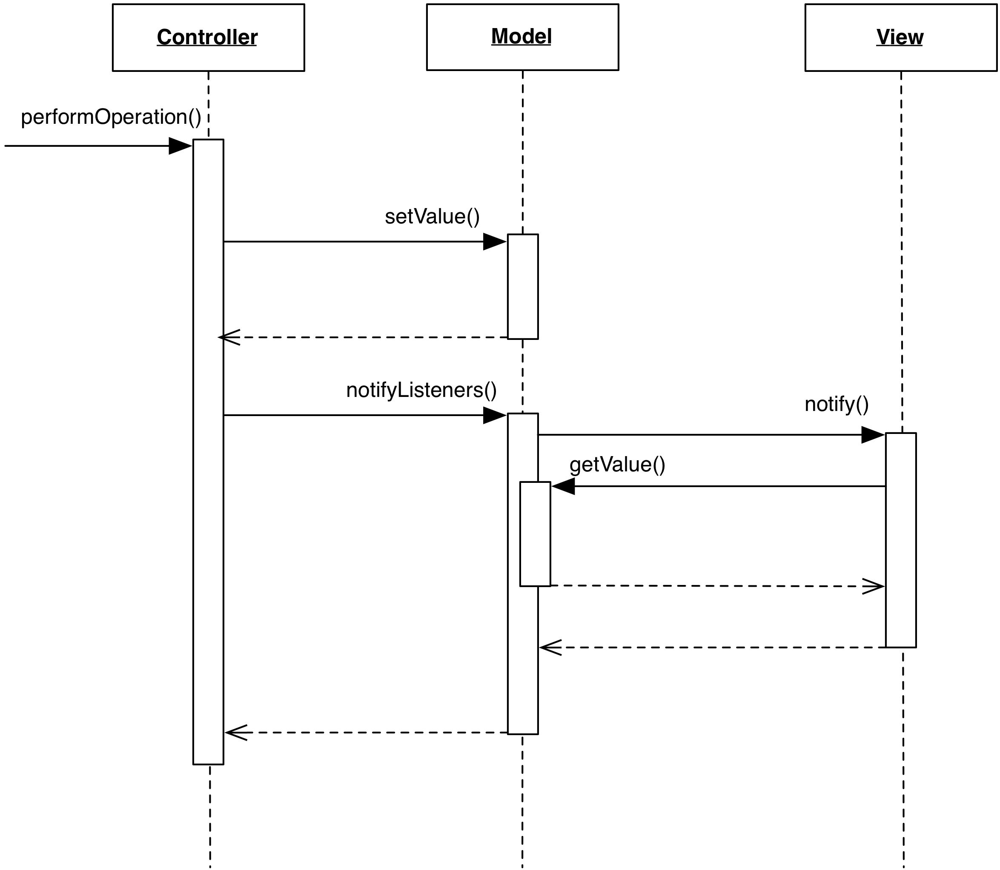

Lazy Model
----------

A Lazy Model is an intermediate solution between Active and Passive Model that retains
centrality of the notification bookkeeping, but delegates notification triggering. 
Like an Active solution, listeners register on the Model and await for
notification; Differently from it, methods that modify the Model do not call
``Model.notifyListeners()``. Instead, the Controller issues the call.

A Lazy Model is a good strategy when we want to retain full control on the
notification flow as in the Passive model, but at the same time we want to keep
the listeners' list centralized so that they can all be notified of the changes,
no matter which Controller performs them.

