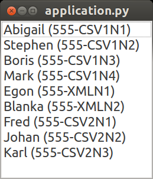
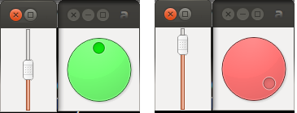

MVC Variation
=============

Traditional MVC is excellent as a starting point for discussion, but by no
means it must be considered the one and only proper way of doing MVC: real
applications are built around its basic concepts, but include plenty of tricks,
extensions and alternative design choices to satisfy the final requirements
while keeping programming complexity as low as possible. Examples of such
requirements include:

   - a modal dialog must allow changing values, but revert them when the Cancel
     button is pressed.
   - a modeless dialog allows changing values while the change is visible in
     another window, but must be reverted if “Restore” is pressed.
   - prevent typing of invalid values, for example a string in a line edit
     supposed to accept only digits will not accept any key presses from
     non-digits.
   - alternatively, allow invalid entries, but disable the Ok button and mark
     the incorrect value red.
   - and so on...

As you can see, the complexity of an application made of hundreds of menus,
text input areas and buttons, plus all the possible logical dependencies among
them can grow considerably. Unexpected interactions and strange communication
patterns emerge in the form of bugs or application freezes. Keeping this
communication network well organized and confined by enforcing a structure is
of paramount importance.

In this chapter we will examine alternative design in MVC able to deal with
more complex use-case scenarios, constrained by requirements, architectural
needs or self-documentation purposes.

Compositing Model
-----------------

**Addressed Need: Aggregation of information from submodels.**

We will create a trivial address book application whose data sources are two
comma-separated (CSV) files and one XML file. The objective is to have a View
that can display data regardless of the number of sources, and that allows
extension to other storage formats without excessive modifications. The final
application is a simple Qt ListWidget with one name and telephone number per
each row

The Model layer is composed of three classes: two of them provide readonly
access to each file format (CSV or XML). The third uses the previous two,
manipulating the data for more convenient handling, in this case merging. The
resulting class AddressBook is a Compositing Model: it acts both as a Model for
its View (the ``AddressBookView``) and as a View for its submodels instances

.. image:: _static/images/CompositingModel/compositingmodel.png
   :align: center

The code for class ``AddressBookCSV`` is here shown to illustrate the rather
trivial interface supported by all Model objects. The common base class
BaseModel provides notification services by implementing the well known methods
``register``, ``unregister``, ``notifyListeners``, and the listeners set, as shown in
Traditional MVC::

   class AddressBookCSV(BaseModel):
       def __init__(self, filename):
           super(AddressBookCSV, self).__init__()
           self._filename = filename

       def numEntries(self):
           try:
               return len(open(self._filename, "r").readlines())
           except:
               return 0

       def getEntry(self, entry_number):
           try:
               line = open(self._filename, "r").readlines()[entry_number]
               name, phone = line.split(',')
               return { 'name' : name.strip(), 'phone' : phone.strip()}
           except:
               raise IndexError("Invalid entry %d" % entry_number)

The code for the View is simplified by the fact that there's no Controller. No
modifications are allowed on our Models, so no GUI events need to be handled::

    class AddressBookView(QtGui.QListWidget):
        def __init__(self, model, *args, **kwargs):
            super(QtGui.QListWidget, self).__init__(*args, **kwargs)
            self._model = model

            self._model.register(self)

The ``notify`` method extracts data from the Model and repopulates the ListWidget
after clearing it. As a general rule, this method is rather aggressive and may
introduce flickering or loss of selection of the List items. Solving these
issues is beyond the scope of this example. Additionally, the List does not
need regular refresh cycles, because the Models are readonly and parsed only
once at startup::

    class AddressBookView(QtGui.QListWidget):
        # ...
        def notify(self):
            self.clear()

            for i in range(self._model.numEntries()):
                entry = self._model.getEntry(i)
                string = "%s (%s)" % (entry["name"], entry["phone"])
                self.addItem(string)

Note how the View is agnostic of the actual Model type, and can render data
from either ``AddressBookCSV`` or ``AddressBookXML``. This is expected, as we
are programming against an interface. The Compositing Model class ``AddressBook``
implements the same interface and will therefore be rendered transparently by
the ``AddressBookView``. 

The ``AddressBook`` class accepts an arbitrary number of Models at initialization,
and registers as a listener on each of them. The interface expected by
``AddressBookView`` is reimplemented, deriving the data from the composition of
the submodels ::

   class AddressBook(BaseModel):
       def __init__(self, models):
           super(AddressBook, self).__init__()

           self._models = models

           for m in self._models:
               m.register(self)

The total number of entries is trivially the sum of the number of entries
provided by each submodel ::

    class AddressBook(BaseModel):
        # ...
        def numEntries(self):
            return sum([m.numEntries() for m in self._models])

To get a specific entry, we need to map the absolute entry number to the
relative entry number in a specific submodel, keeping into account the number
of elements in each submodel. We define the accumulate routine to compensate
for the lack of it in python2 ::

    class AddressBook(BaseModel):
        # ...
        def getEntry(self, entry_number):
            def accumulate(l):
                current_total = 0
                res = []
                for i in l:
                    current_total += i
                    res.append(current_total)
                return res
            accumulated = accumulate([m.numEntries() for m in self._models])
            source_idx = map(lambda x: x <= entry_number,
                             accumulated).index(False)
            try:
                return self._models[source_idx].getEntry(
                                       entry_number - accumulated[source_idx]
                                       )
            except:
                raise IndexError("Invalid entry %d" % entry_number)

Finally, when any of the submodels notify a change, the Compositing Model
should just perform a notification to its listener, in our case the
``AddressBookView`` ::

    class AddressBook(BaseModel):
        # ...
        def notify(self):
            self.notifyListeners()

The application main routine creates the three datasource models, and passes
them to the Compositing Model ``AddressBook``, which is then passed to the View ::

   csv1_model = AddressBookCSV("file1.csv")
   xml_model = AddressBookXML("file.xml")
   csv2_model = AddressBookCSV("file2.csv")

   address_book = AddressBook([csv1_model, xml_model, csv2_model])

   view = AddressBookView(address_book)

In this case, the Compositing Model is performing union of homogeneous
information originating from different sources, but this is not the only case
where a Compositing Model can be useful. Another example is to extract relevant
information from different Models and present them in an easy to query Façade.
These Models are normally conceived to simplify access from a View with
specific presentation objectives. 

Model-Pipe-View-Controller
--------------------------

**Addressed Need: Intercept and filter the data flow between Model and View.**

An additional need that may emerge from our addressbook application is to
filter out names and sort them alphabetically. A possible design approach would
be to include this logic directly into the AddressBook Model, but this approach
would not work if we required two Views to observe the  Model, maybe with
different search criteria for the filter. The next plausible candidate for
hosting this logic is the View, but this can also lead to problems. The View
might have a visual understanding of the semantic of the data, for example it
knows how to extract a name from the Model and knows where it should go in the
GUI, but does not necessarily possess enough logical understanding of the Model
or be the most appropriate place to perform extravagant manipulations. Despite
the shortcomings, both approaches may be a good compromise depending on the
circumstances. 

An alternative approach that cuts through the problem is a
**Model-Pipe-View-Controller** design, a variation of the Compositing Model
approach. It introduces an additional Model class, called **Pipe**, to intercept
the data flow between Model and View and add flexibility for data manipulation
while in transit. Its concept is similar to a UNIX pipe, and its most common
use is for filtering and sorting. 

The Pipe class encapsulates the transformation logic in a dedicated,
potentially reusable Model class. Different Pipe classes can be created, each
with specific capabilities. To be compatible with the View, a Pipe should
implement the same interface of the submodel, eventually extending it for the
additional state it might contain. Pipes can also be chained together to
perform sequential reduction of data.

To present a real case implementation of Model-Pipe-View-Controller, we will
add two new Pipe classes to the Model layer introduced in the earlier section:
one for filtering (``AddressBookFilter``) and for sorting
(``AddressBookSorter``), as represented in Fig. 5. 

.. image:: _static/images/ModelPipe/modelpipe-schema.png
   :align: center

The implementation will also require two separated Views, both contained in the
same window: the ``AddressBookView`` was introduced in the previous section and
will be connected to the Sorter Model as the end point of the Model chain; The
``FilterView`` will instead display and modify the filter string, and will connect
to the ``AddressBookFilter`` Model.  We will explain the motivations for this
design later in the explanation. 

The ``AddressBookFilter`` registers on the filtered Model and holds the current
filter string ::

   class AddressBookFilter(BaseModel):
       def __init__(self, model):
           super(AddressBookFilter, self).__init__()
           self._filter_string = ""
           self._model = model
           self._model.register(self)

To modify the filter string, we need a ``setFilter`` method. When a new string is
set, the product of the ``AddressBookFilter`` Model is expected to change, so
``_notifyListeners`` is called. ::

    def setFilter(self, string):
        self._filter_string = string
        self._notifyListeners()

The actual filtering is performed on the fly on the underlying data in the
``numEntries`` and ``getEntry`` methods, which is the usual interface for the
Model in the address book application ::

    def numEntries(self):
        entries = 0
        for i in xrange(self._model.numEntries()):
            entry = self._model.getEntry(i)
            if self._filter_string in entry["name"]:
                entries += 1

        return entries

    def getEntry(self, entry_number):
        entries = 0
        for i in xrange(self._model.numEntries()):
            entry = self._model.getEntry(i)
            if self._filter_string in entry["name"]:
                if entries == entry_number:
                    return entry
                entries += 1

        raise IndexError("Invalid entry %d" % entry_number)

Finally, the Filter forwards notifications from its submodel to its listeners ::

    def notify(self):
        self._notifyListeners()

Similarly, the ``AddressBookSorter`` is defined to register on a Model for
notifications. The current implementation supports only a simple A-z
alphabetical sorting, and as such does not need to expose state for changes.
Typical examples of possible state would be ascending vs. descending or the
sorting key.  The Sorter would then expose setters for all these values, and
the View would have to provide supporting widgets to modify them ::

   class AddressBookSorter(BaseModel):
       def __init__(self, model):
           super(AddressBookSorter, self).__init__()
           self._model = model
           self._model.register(self)
           self._rebuildOrderMap()

       def numEntries(self):
           return self._model.numEntries()

We implement the sorting naively, by walking through the underlying data and
building an index-to-index mapping ::

    def _rebuildOrderMap(self):
        values = []

        for i in range(self._model.numEntries()):
            values.append( (i, self._model.getEntry(i)["name"]) )

        self._order_map = map(lambda x: x[0], 
                              sorted(values, key=operator.itemgetter(1))
                             )

The mapping is internal state that does not need to be exposed to the View, but
must stay synchronized at all times with the underlying Model. Consequently, it
must be recomputed every time the underlying Model reports a change ::

    def notify(self):
        self._rebuildOrderMap()
        self._notifyListeners()

We will then use the order map to extract entries in the appropriate order from the underlying Model ::

    def getEntry(self, entry_number):
        try:
            return self._model.getEntry(self._order_map[entry_number])
        except:
            raise IndexError("Invalid entry %d" % entry_number)

Finally, we need a View and Controller to modify the filter string. The View is
a QLineEdit with some layouting and labeling. Its signal ``textChanged`` triggers
the Controller's ``applyFilter`` method, so that as new characters are typed in,
the Controller will change the filter string. Note how ``FilterView`` does not need
a ``notify`` method: we don't expect the filter string to change from external
sources, and ``QLineEdit`` is an autonomous widget which keeps its own state and
representation synchronized ::

   class FilterView(QtGui.QWidget):
       def __init__(self, *args, **kwargs):
           super(QtGui.QWidget, self).__init__(*args, **kwargs)
           self._initGUI()
           self._model = None
           self._controller = FilterController(self._model)
           self.connect(self._filter_lineedit,
                        QtCore.SIGNAL("textChanged(QString)"),
                        self._controller.applyFilter
                        )
       def _initGUI(self):
           self._hlayout = QtGui.QHBoxLayout()
           self.setLayout(self._hlayout)
           self._filter_label = QtGui.QLabel("Filter", parent=self)
           self._hlayout.addWidget(self._filter_label)
           self._filter_lineedit = QtGui.QLineEdit(parent=self)
           self._hlayout.addWidget(self._filter_lineedit)

We want to delay the setting of the Model after instantiation, so we need a
setter method and design View and Controller to nicely handle None as a Model,
always a good practice [#]_. The reason for this delayed initialization is that
both ``FilterView`` and ``AddressBookView`` are visually contained into a dumb
container. We will detail this point when analyzing the container ::

    def setModel(self, model):
        self._model = model
        self._controller.setModel(model)

The ``FilterController`` needs only the Model, initially set to ``None`` by the View ::

   class FilterController(object):
       def __init__(self, model):
           self._model = model

       def setModel(self, model):
           self._model = model

The ``applyFilter`` method simply invokes ``setFilter`` on the associated Model, which
must be the  AddressBookFilter instance. Due to Qt Signal/Slot mechanism, this
method receives a ``QString`` as argument, so we need to convert it into a python
string before setting it into the Model ::

    def applyFilter(self, filter_string):
        if self._model:
            self._model.setFilter(str(filter_string))

As described early, the final application will have two Views in the same
window, one above the other. To achieve this, we need a container widget to
layout the two Views. We don't want to convey any misdirection about this
container being anything else but a dumb container, so its initializer does not
accept the Models. We will instead set the Model on each individual View from
the outside through their setModel methods described earlier ::

   class ContainerWidget(QtGui.QWidget):
       def __init__(self, *args, **kwargs):
           super(ContainerWidget, self).__init__(*args, **kwargs)
           self.filterview = FilterView(parent=self)
           self.addressbookview = AddressBookView(parent=self)
           self._vlayout = QtGui.QVBoxLayout()
           self.setLayout(self._vlayout)
           self._vlayout.addWidget(self.filterview)
           self._vlayout.addWidget(self.addressbookview)

To set up the application, there is little variation from the Compositing Model
example: we set up the ``AddressBook`` Model from the individual submodels. ::

   csv1_model = AddressBookCSV("../Common/file1.csv")
   xml_model = AddressBookXML("../Common/file.xml")
   csv2_model = AddressBookCSV("../Common/file2.csv")
   address_book = AddressBook([csv1_model, xml_model, csv2_model])

The Pipes are then created and chained one after another ::

   address_book_filter = AddressBookFilter(address_book)
   address_book_sorter = AddressBookSorter(address_book_filter)

``AddressBookSorter`` will then be passed to ``AddressBookView`` to display the data at
the end of the process, and ``AddressBookFilter`` will be passed as a Model for
``FilterView``/``FilterController`` to modify the search string ::

   widget = ContainerWidget()
   widget.addressbookview.setModel(address_book_sorter)
   widget.filterview.setModel(address_book_filter)
   widget.show()

Why did we partition the GUI into two Views, instead of having a unified View
attached to the last Model in the chain and containing both the List and the
Filter line edit? This unified View would have to install its Controller to
modify the Filter string on an AddressBookFilter, but the passed Model is an
AddressBookSorter. The Sorter would therefore have to provide a method to
extract its submodel. The unified View would then invoke this method, hope that
the returned Model is a Filter, and finally pass it to the FilterController.
This would fail if the Sorter is removed from the schema, or another Pipe
object is added on either side of the Sorter. Such design is therefore rather
brittle. 

A solution with two separated Views give a more flexible, resilient and cleaner
design: the List does not need to know about the nature of its Model, it just
asks for its data; the Pipe chain can be modified without affecting the View;
The ``FilterView`` is attached to its natural Model, the ``AddressBookFilter``,
and its Controller can be installed safely without any fragile traversal of the
Pipe chain.

.. [#] Additionally, when a View or Controller allows to change the Model after
   initialization, it is important that ``setModel`` unregisters the View from the
   old Model, or it will keep sending change notifications. We skip this step
   because we never register for notifications in the first place.

Application Model (MMVC)
------------------------

**Addressed Need: separate visual state from business state. Grant visual state a dedicated Model.**

In Traditional MVC we pointed out that a Model object should not contain GUI
state. In practice, some applications need to preserve and manage state that is
only relevant for visualization. Traditional MVC has no place for it, but we
can satisfy this need with a specialized Compositing Model: the **Application
Model**, also known as Presentation Model. Its submodel, called **Domain Model**,
will be kept unaware of such state. To present a practical example. imagine
having a Domain Model representing an engine :: 

   class Engine(BaseModel):
       def __init__(self): 
           super(Engine, self).__init__()  
           self._rpm = 0 

       def setRpm(self, rpm):
           if rpm != self._rpm:
               self._rpm = rpm
               self._notifyListeners()

       def rpm(self):
           return self._rpm

Initial specifications require to control the revolution per minute (rpm) value
through two Views: a Slider and a Dial. Two View/Controller pairs observe and
act on a single Model 

.. image:: _static/images/DomainModelApplicationModel/basic_layout.png
   :align: center

Suppose an additional requirement is added to this simple application: the Dial
should be colored red for potentially damaging rpm values above 8000 rpm, and
green otherwise.

We could violate Traditional MVC and add visual information to the Model,
specifically the color ::

   class Engine(BaseModel):
      <proper adaptations to init method>

      def dialColor(self):
         if self._rpm > 8000:
            return Qt.red
         else:
            return Qt.green

With this setup, when the Dial receives a change notification, it can inquire
for both the rpm value to adjust its position and for the color to paint itself
appropriately. However, the Slider has no interest in this information and now
the Engine object is carrying a Qt object, gaining a dependency against GUI.
This reduces reuse of the Model in a non-GUI application.  The underlying
problem is that the Engine is deviating from business nature, and now has to
deal with visual nature, something it should not be concerned about.
Additionally, this approach is unfeasible if the Model object cannot be
modified.  

An alternative solution is to let the Dial View decide the color
when notified, like this ::

   class Dial(View):
       def notify(self):
           self.setValue(self._model.rpm())
           palette = QtGui.Qpalette()

           color = Qt.green
           if self._model.rpm() > 8000:
               color = Qt.red

           palette.setColor(QtGui.Qpalette.Button, color)
           self.setPalette(palette)

Once again, this solution is impractical, and for a complementary reason: the
View has to know what is a dangerous rpm amount, a business-related concern
that should be in the Model. This solution may be acceptable for those limited
cases when the logic connecting the value and its visual representation is
simple, and the View is designed to be agnostic of the meaning of what is
showing to the User. For example, a label displaying negative values in red may
be used to show bank account balances. The real meaning of a negative balance,
the account is overdrawn, is ignored. A better solution would be to have the
BankAccount Model object provide this logic as isOverdrawn(), and the label
color should honor this semantic, not the one implied by the numerical value.

Given the point above, it is clear that the Engine object is the only entity
that can know what rpm value is too high. It has to provide this information,
leaving its visual representation strategy to the View.  A better design
provides a query method ``isOverRpmLimit`` ::

   class Engine(BaseModel):
       <...>
       def isOverRpmLimit(self):
           return self._rpm > 8000

The View can now query the Model for the information and render it appropriately ::

   class Dial(View):
       def notify(self):
           <...>
           color = Qt.red if self._model.isOverRpmLimit() else Qt.green

           palette.setColor(QtGui.QPalette.Button, color)
           self.setPalette(palette)

This solution respects the semantic level of the business object, and allows to
keep the knowledge about excessive rpm values in the proper place. It is an
acceptable solution for simple state.  

With this implementation in place we can
now extract logic and state from Dial View into the Application Model
DialEngine. The resulting design is known as Model-Model-View-Controller

.. image:: _static/images/DomainModelApplicationModel/model_model_view_controller.png
   :align: center

The DialEngine will handle state about the Dial color, while delegating the rpm
value to the Domain Model. View and Controller will interact with the
Application Model and listen to its notifications.  Our Application Model will
be implemented as follows. In the initializer, we register for notifications on
the Domain Model, and initialize the color ::

   class DialEngine(BaseModel):
     def __init__(self, engine):
       super(DialEngine, self).__init__()
       self._dial_color = Qt.green
       self._engine = engine
       self._engine.register(self)

The accessor method for the color just returns the current value ::

   class DialEngine(BaseModel):
        # ...
        def dialColor(self):
            return self._dial_color

The two accessors for the rpm value trivially delegate to the Domain Model ::

   class DialEngine(BaseModel):
        # ...
        def setRpm(self, rpm):
            self._engine.setRpm(rpm)

        def rpm(self):
            return self._engine.rpm()

When the ``DialController`` issues a change to the Application Model through the
above accessor methods, this request will be forwarded and will generate a
change notification. Both the Slider and the Application Model will receive
this notification on their method notify. The Slider will change its position,
and the Application Model will change its color and reissue a change
notification ::

   class DialEngine(BaseModel):
        # ...
        def notify(self):
            if self._engine.isOverRpmLimit():  
              self._dial_color = Qt.red
            else: 
              self._dial_color = Qt.green

            self._notifyListeners() 

The DialView will handle this notification, query the Application Model (both
the rpm value and the color) and repaint itself. Note that changing the
``self._dial_color`` in ``DialEngine.setRpm``, as in ::

   class DialEngine(BaseModel):
        # ...
        def setRpm(self, rpm):
            self._engine.setRpm(rpm)

            if self._engine.isOverRpmLimit():  
                self._dial_color = Qt.red
            else: 
                self._dial_color = Qt.green

instead of using the ``notify`` solution given before, would introduce the
following problems: 

   - the dial color would not change as a consequence of external changes on
     the Domain Model (in our case, by the Slider)
   - There is no guarantee that issuing ``self._engine.setRpm()`` will trigger a
     notification from the Domain Model, because the value might be the same.
     On the other hand, the Application Model might potentially change
     (although probably not in this example), and should trigger a notification to
     the listeners. Solving this problem by adding a self._notifyListeners call to
     DialEngine.setRpm will end up producing two notifications when the Domain Model
     does issue a notification.

An Application Model is closer to the View than a Domain Model, and therefore
able to take into account specific needs of the View it is addressing: in a
scrollable area, where only a part of the overall Model is visible it can hold
information about the currently visible portion of the Domain Model, and
suppress those notifications reporting changes in data currently not visible,
preventing a useless refresh. It can also be used to distill information from
multiple Domain Models, producing something that is relevant for its View. For
example, our Domain Model may be made of objects representing the employees in
a company, company departments and so on, in a rather elaborate network. If the
View wants to display a list of employees regardless of the department, maybe
with a checkbox to select them for further processing, it is convenient to have
an Application Model presenting data to the View as a list, gathering the
details from the Domain Model objects (non-graphical information) while at the
same time keeping track and presenting the checkbox state as well (graphical
information). As a drawback, it is much less reusable: multiple Views can
interact with the same Application Model only if they agree on the visual state
representation (e.g. we want both the Dial and the Slider red when over the rpm
limit). 

Side-by-Side Application Model - Selection Model
------------------------------------------------

**Addressed Need: Keep View state in a separate Model, not wrapping the Domain Model.**

An alternative approach to Application Model is possible: instead of wrapping
the Domain model, the Application Model provides only visual state and
functionality. The View depends on both Models

[picture]

Obviously, the Application Model keeps registering itself on the Domain model::

   class DialViewModel(BaseModel):
      def __init__(self, engine):
      super(DialViewModel, self).__init__()
         self._dial_color = Qt.green
         self._engine = engine
         self._engine.register(self)

      def color(self):
         return self._dial_color
      
      def notify(self):
         if self._engine.isOverRpmLimit():
            self._dial_color = Qt.red
         else:
            self._dial_color = Qt.green
         self._notifyListeners()

The dial now registers to both Models, and listens to notifications from both.::

   class Dial(QtGui.QDial):
   <....>
      def setModels(self, model, view_model):
         if self._model:
            self._model.unregister(self)
         if self._view_model:
            self._view_model.unregister(self)

         self._model = model
         self._view_model = view_model

         self._controller.setModel(model)
         self._model.register(self)
         self._view_model.register(self)

      def notify(self):
         self.setValue(self._model.rpm())  
         palette = QtGui.QPalette() 
         palette.setColor(QtGui.Qpalette.Button,self._view_model.color())
         self.setPalette(palette)

Note how the Dial cannot differentiate which of the two Models is delivering
the message, and how in particular it will be potentially notified twice: once
by the change in the Domain model, and another time by the change in the
Application Model, in itself triggered by the previous change in the Domain
model. Particular care may be needed if the notify method is time consuming.
Another case of Application Model usage is a plot with changing scale. The
state of the View (its scale and positioning) is part of a “separate model”
that is pertinent only to the View. The Domain model, which holds the plot
data, should not be involved in the zoom factor or plot limits.

A side-by-side solution is frequently used to implement selection, a common GUI
paradigm to operate on a data subset. Selected data normally have a different
visual aspect, such as highlighting or a checkbox. This information is then
used to drive operations on the specified subset. Selection has therefore a
dualistic nature of holding state that is both visual and business related.  A
trivial strategy is to include selection state directly on the Domain Model,
for example as a flag associated to the item. Depending on the application,
this may or may not be an appropriate solution: if two Views observe the same
Model, and an item is selected in one View, you might or might not want the
other View to obtain this selection information. For example, a GUI allowing
the user to select elements from a list, but also have a label saying “3 items
selected” would work with selection on the Domain Model. If selection cannot be
shared between Views, or we want to keep selection as an independent concern,
a sensible strategy is to host it as a separate side-by-side Selection Model.

One problem with a Selection Model is that it must be tolerant to changes in
the Domain Model. If a selected entity is removed from the Domain Model, the
selection status must be cleared of that entity. This is important, because if
the Selection Model is then used to perform collective operations (for example,
change the color of all selected items) an operation will be attempted on an
item no-longer existing in the Domain Model. Add operations are also not immune
from problems: the Selection Model might have to resize itself to match the
Domain Model, so that it does not go out of bounds when inquire is performed
about the selection status of the new entries. Modifications may reorder and
invalidate indexes in the Domain Model, making the selection outdated. Finally,
when synchronization is achieved between the Domain Model and the Selection
Model, the View will be notified twice: once by the change in the Domain Model,
and again by the Selection Model. 

invert selection, complex selections, select all, select none.  If data is
added, removed, or modified in the model, the Selection Model must respond
accordingly. For example,

Qualified notification Model
----------------------------

**Addressed Need: provide additional details about the notification**

Inform the View about which model actually changed Prevent a View refresh if
the model changes on some information that is not displayed due to the state of
the view Inform the View of what actually changed, instead of asking for a full
refreshes

The Model can send messages qualified with a subject, so to inform the views of
what kind of change has occurred. OR parametrize the notify method to deliver
information about the change the model has.  Either the View register itself
and lists which messages it is interested in (and only if this matches, the
message is delivered) or it gets all messages and acts only on those who it is
interested in. Alternatively, fragment the Model into two model objects, so
that the View can connect only to the part that is relevant.

To prevent excessive refreshes with multiple changes: pass a flag to update(),
or accumulate changes on the view side and refresh only after a given amount of
time has passed, or add to a queue the changes, then consume the queue until no
more changes are needed, then force visual refresh.  notify() gets called with
a qualified flag, the previous value and the new value.

notify() gets called with a qualified flag, the previous value and the next value

The view subscribes to specific events from the model, and 
receives notifications only when those events actually occur.

A model can also pass a data update object to the listeners, and the view can react
to that update object, instead of resyncing against the new model state.

can't a view fetch information from multiple models, and deliver signals to different controllers having different roles?

A View can depend on different Models, but this requires the View to know which Model is delivering the notification.
Add a note on the fact that if the model pushes information, then this information characteristics falls on the signature of the notifyObserver() methods. So, its signature must be somehow generic. The model pretends to know what the view is specifically interested in, something it might not know, so it must simply send itself, and let the view go through it, or have a protocol to specify what changed.

Drawback: you may end up implementing a protocol in the notify() method.

The view does not inquire the model through an interface.
The model is closed to that. it just produces events with
a data change object, and synchronizes through that.

Advantages: 
 - the data update object may contain logic on how to present itself on the views, especially if this rendering is trivial (e.g. pure text)
 - if the model is on another thread, it pushes and forces the refresh of the view. In the traditional case, the view may lag behind.

Disadvantages:
 - transfer stuff that may be useless for that specific view. The view may then subscribe for specific data and receive only those in the data update object

Passive Model
-------------

**Addressed Need: Use a Model without notification features.**

Traditional MVC uses the so-called **Active Model**: when the Model changes in
response to an action, it notifies its listeners of the occurred change. This
approach is excellent to deal with multiple listeners, multiple Controllers,
and the need to notify about Model changes coming from external sources.

The Active Model strategy has a counterpart in the **Passive Model**. A Passive
Model does not perform notification. Instead, this task is orchestrated by the
Controller:

   #. The Controller modifies the Model.
   #. The Controller informs the View to update itself.
   #. The View now inquires the Model contents as in the Active case.

.. image:: _static/images/PassiveModel/passive_model.png
   :align: center

A mild advantage of this approach is that any object can be used as a Model,
even when it does not provide notification functionality. In practice, adding
this property is trivial.

On the other hand, the major shortcoming is that it doesn't work if the Model
can change through multiple sources (for example, other Controllers connected
to the same Model, or if the Model is a frontend to a database and another
client modifies the data), nor it can handle updating of multiple listeners. 

Despite its apparent lack of potential, a Passive implementation has its area
of excellence in Web-based MVC, where the fundamental nature of the HTTP
protocol prevents the Model to push notifications to the View: on the web, the
View is delivered to the client side for rendering in the browser, and the
Model stays on the server side. When the User performs an action, the
Controller will issue a change request to the Model, followed by a request to
the View to refresh itself. The View will now issue a get request to the server
to synchronize with the new Model contents.

A Passive Model can always be converted into an Active one either through
inheritance or by using a wrapper class satisfying the Passive Model's original
interface. This wrapper will receive change requests from Controllers, delegate
the change requests to the Passive Model, and finally notify the listeners.
This solution is also viable for an already developed business object that
knows nothing about MVC and must be made part of it.  

ModelController
---------------

**Addressed Need:**

Objective-C style (MVA) design, or alternatively, the controller business logic
is merged into the model, and at that point it becomes a simple view/model
interaction. These designs are not necessarily wrong, but they tend to become
brittle or defining excessive responsibility, or making it hard to change the
model, the view, or the controller part if such need occurs.  In the
ModelController-View approach, the ModelController class is a Model with "GUI
intelligence": it knows how to manipulate its internal data in response to GUI
events, applying both consistency and business logic, while at the same time
being able to satisfy requests from View. The obvious disadvantage of this
approach is lack of flexibility and reuse of the Model, which becomes harder to
access and test. Additionally, while the Model can be a simple, "plain old"
object, the ModelController can depend on the GUI framework, since it must
interact with the View and UI events, preventing its reuse outside of the GUI
application. It is also difficult to handle multiple Views, because the
Controller part would have to handle GUI events coming from multiple Views.

Model-View-Adapter (MVA, Mediated MVC, Model-Mediator-View)
-----------------------------------------------------------

**Addressed Need:**

Model-View-Adapter is a variation of Traditional MVC and common in Apple OSX
Cocoa Framework. In MVA, all communication must flow through Controllers. The
Model and the View don't have references to each other, and they don't exchange
data or interact directly. This design is an implementation of the Mediator
pattern, and for this reason Controllers are generally referred as Adapters or
Mediators.  This approach might appears excessively strict, but has some
advantages: the communication network is artificially constrained, making it
easier to evaluate and debug. The orchestration is heavily centralized:
Controller becomes the communication hub, taking signals from either the Model
objects (change notifications) or the View (user events) and delivering them to
the intended receiver after transformation into an API call. For this reason,
the Controller must know the API of all the Views and the Models it interacts
with. On the other hand, and in strong contrast to traditional MVC, the View is
now completely decoupled from the Model, and is therefore not required to be
aware its API.
With the Controller in full control on the dialog between the two remaining
parties, smart tricks can be performed on the “in transit” data: for example,
the Controller could be responsible for formatting,  translating or ordering
the data from the Model.  Let's examine the code for our standard example. The
Model is unchanged: stores rotations per minute information and notifies about
changes ::

   class Engine(BaseModel):
       def __init__(self):
           super(Engine, self).__init__()
           self._rpm = 0

       def setRpm(self, rpm):
           if rpm < 0:
               raise ValueError("Invalid rpm value")

           if rpm != self._rpm:
               self._rpm = rpm
               self._notifyListeners()

       def rpm(self):
           return self._rpm

The two View classes, Dial and Slider, are now unaware of the Model. Instead,
they know about the Controller, and accept changes to their content through the
setRpmValue() method.  A matter of taste can decide the semantic level of this
method. Should it talk “domain language” (i.e. Rpm) or not (i.e. the method
should just be named setValue). In any case, Views behave differently with
respect to the issued value, and we don't want this difference to be handled by
the Controller.  When the user interacts with the Dial, the Controller
changeRpm() method is directly invoked, in this case via the Qt Signal/Slot
mechanism ::

   class Dial(QtGui.QDial):
       def __init__(self, *args, **kwargs):
           super(Dial, self).__init__(*args, **kwargs)
           self._controller = None
           self.setRange(0,10000)

       def setRpmValue(self, rpm_value):
           self.setValue(rpm_value)

       def setController(self, controller):
           self._controller = controller
           self.connect(self, QtCore.SIGNAL("valueChanged(int)"),
                              self._controller.changeRpm)

For the Slider, the interface is similar, but the internal implementation is
slightly different. Again, the setRpmValue allows the Controller to change the
View contents. In this case however, a proper transformation of the data is
performed to deal with the specifics of the Slider behavior, whose range is
from 0 to 10.  Similarly, when the User interact with the Slider, the method
_valueChanged will be invoked, which in turn will issue a call to the
Controller'' changeRpm() method, after transformation of the parameter::

   class Slider(QtGui.QSlider):
       def __init__(self, *args, **kwargs):
           super(Slider, self).__init__(*args, **kwargs)
           self._controller = None
           self.connect(self, QtCore.SIGNAL("valueChanged(int)"),
                              self._valueChanged)
           self.setRange(0,10)

       def setRpmValue(self, rpm_value):
           self.setValue(rpm_value/1000)

       def setController(self, controller):
           self._controller = controller

       def _valueChanged(self, value):
           if self._controller:
               self._controller.changeRpm(value*1000)

The Controller class handles the Model and the two Views accordingly. It
registers for notifications on the Model, and it receives notification from the
Views on its changeRpm() method, where it modifies the contents of the Model.
When the Model communicates a change, it pushes the new value to the Views::

   class Controller(object):
       def __init__(self):
           self._views = []
           self._model = None

       def setModel(self, model):
           self._model = model
           model.register(self)

       def addView(self, view):
           view.setController(self)
           self._views.append(view)

       def changeRpm(self, rpm):
           if self._model:
               self._model.setRpm(rpm)

       def notify(self):
           for view in self._views:
               view.setRpmValue(self._model.rpm())

The pattern of communication in MVA can be represented with the following
interaction diagram

[picture]

Which can be described with the following steps
   1. The View receives a User action. It calls an appropriate method on the Controller.
   2. The Controller sets the value on the Model.
   3. The Model notifies its listeners of the change, among which is the Controller itself.
   4. The Controller receives the change in its notify() method, where it updates the Views.
   5. The Views are updated to fit the new Model value

Model-GUI-Mediator
------------------

**Addressed Need:**

One problem with Model-View-Adapter is that it assumes the Views are derived
classes, each implementing specific behavior. In the previous example, each
View performed a specific transformation to the data before displaying: the
Dial left it as is, while the Slider divided it by 1000. In the
Model-GUI-Mediator, the desire is not to reimplement the toolkit's widgets,
because it generally leads to proliferation of View classes. Instead, widgets
are used as they are, off-the-shelf from the toolkit. The obvious consequence
is that logic that is pertinent to the conversion of data for visualization
must go somewhere else. The Controller seems the obvious choice, however
keeping the same design as in MVA would be cumbersome: the single Controller
would have to differentiate the Views, and submit properly transformed data to
each View.  A better solution is to have different Controllers, one per each
View, doing the relevant transformation.  The code would therefore be like the
following: The View being an off-the-shelf component means it does not know
anything about the Controller. All the signal setup is done by the individual
Controllers. Also, off-the-shelf classes are not implementing the Observer
pattern::

   class DialController(object):
       def __init__(self):
           self._view = None
           self._model = None

       def setModel(self, model):
           self._model = model
           self._model.register(self)

       def setView(self, view):
           self._view = view
           self._view.setRange(0,10000)
           self._view.connect(self._view, 
                              QtCore.SIGNAL("valueChanged(int)"),
                              self.changeRpm)

       def changeRpm(self, rpm):
           if self._model:
               self._model.setRpm(rpm)

       def notify(self):
           if self._view:
               self._view.setValue(self._model.rpm())

And for the Slider it would be ::

   class SliderController(object):
       def __init__(self):
           self._view = None
           self._model = None

       def setModel(self, model):
           self._model = model
           self._model.register(self)

       def setView(self, view):
           self._view = view
           self._view.setRange(0,10)
           self._view.connect(self._view, 
                              QtCore.SIGNAL("valueChanged(int)"),
                              self.changeRpm)

       def changeRpm(self, rpm):
           if self._model:
               self._model.setRpm(rpm*1000)

       def notify(self):
           self._view.setValue(self._model.rpm()/1000)

The setup now can simply make use of off-the-shelf QDial and QSlider instances::

   dial = QtGui.QDial(container)
   dial_controller = DialController()
   dial_controller.setView(dial)
   dial_controller.setModel(engine)

   slider = QtGui.QSlider(container)
   slider_controller = SliderController()
   slider_controller.setView(slider)
   slider_controller.setModel(engine)

The Model-GUI-Mediator approach basically has the Controller adapt the
off-the-shelf widget to be aware of the Model. This requires no subclassing. In
a sense, Model-GUI-Mediator is similar to Document-View, but it reorganizes
competences in a different way and splits the View into off-the-shelf
functionality and application-contextual functionality.

Local Model
-----------

**Addressed Need:**

Keep in mind that is acceptable to have multiple local models, instead of a
single global model.  Canceling modifications: local model vs global model.

Model-View notification decoupling
----------------------------------

**Addressed Need:**

A problem carried over from the traditional MVC approach is the dependency of
the Model toward the views for notification purposes. When the model changes,
there's a need for the views to know this change occurred, but can we devise a
strategy to prevent the model to know about the views? The answer is to
decouple the dependency through a notification system, acting as an
intermediate between models and views. With a notification system, we
substitute the model dependency against the View with a dependency against the
notification system. Qt is an example of such strategy in place: a basic
strategy for Model objects is to make them derived classes of QObject. This Qt
core object provides “fire and forget” notifications to the Model: Qt signals.
The model does not need to know who is interested in these signals, and the
bookkeeping and invocation of the listeners' methods (Qt slots) is performed by
the notification system.  The clear advantage is that the notification system
is not a GUI object, allowing the Model to be tested without involving the GUI.
The model is also allowed to have multiple notification signals for different
conditions. Implementing the same with the traditional MVC approach would imply
FIXME
With a notification system, interested views are notified of the occurred
changes in the model, so they can update their state against the Model. 

With the model not knowing details about the other roles, with the exception of
a vague interface, there's no requirement for the model to understand special
semantics that are not his concern, such as the “GUI talk” that the View uses.
The model simply provides services about its state. it does not request
services to the other roles.  If needed, this data can eventually be persisted
and retrieved from external storage, like a file on the disk or a database. We
will examine design strategies for persistence later in this document.

Application Controller
----------------------

Passive View
------------

Passive View is a variation of MVC where the view is completely under direction
of the Controller, both for the handling of events and for the updating of the
View contents. The advantage is that all application code goes in the
controller, which can be tested effectively. The view is therefore normally
made of standard components from a widget set, with no application-related
intelligence.

When the view is shown, it will have to update its content. However, if the
view is not visible, it should not receive events, so it should either
unsubscribe from the model when hidden, or mute the delivery by first checking
if it's visible before proceeding to update itself. The reason is that if a
view is connected to the model, and this view requires time to refresh itself,
we don't want to trigger this refresh if the view is not visible to the user.

Humble Dialog
-------------
With the Humble dialog approach, the View is passive, and its contents is set
from the outside by a ControllerModel object. Widgets in the View have no
awareness of the Model. This approach reduces as much as possible the code that
is hard to test (Graphical interaction) to an extremely thin layer of
one-to-one Model-View connections that act on the widgets.  The diffeernce with
PassiveView is that in passive view the widgets are under direct control of the
controller. in Humble dialog they are bound 

Widget-level vs Container-level MVC
-----------------------------------
In our previous exploration we defined Views without much attention on the
scope of their implementation. Should we have multiple minimalistic triads,
where every widget is a View of its triad, or a single MVC triad whose complex
View holds and manages dozen of widgets? Both approaches are possible, and they
are called Widget-level and Container-level MVC, respectively.  Widget-level
MVC favors minimalistic MVC components. Each View is defined by a single
widget, which is connected to the Model through a simple Controller. For
example, a CheckBoxView could be connected to a simple boolean variable in the
Model (True/False, honoring the state of the Checkbox) via a
CheckBoxController. Similar Controllers can be setup for each widget of our
graphic toolkit.
This implementation has several advantages: the connection between the GUI
component and a program variable (or set of variables) is simple and
straightforward, and a relatively limited palette of generic controllers can be
implemented and reused. Specialized Controllers can be developed to address
specific conversions and constraints: a generic LineEdit could be connected to
a Model string variable via a LineEditStringController, or to a float variable
via a LineEditFloatController. The Controller would take care of validating and
converting the data type (for example, from the string provided by the LineEdit
to a float)

[FIXME add code/image]

Although very attractive, Widget-level MVC is not without shortcomings: its
infinitesimal granularity could scale badly for large applications, and
conversion of data between the Model representation (e.g. float) and the View
representation (e.g. string) could require reimplementation of either the View
or the Model class in some toolkits. Another shortcoming is that it only acts
as a data transport from View to Model and vice-versa for a specific widget.
The controller may be too trivial in some cases, in particular with complex
Models (e.g. multiple instances must be handled) or complex Views (e.g.
different widgets that need to be analyzed by the controller at the same time).
One possible solution to these shortcomings is to aggregate different Views
into a single class and keep the MVC triads confined there. The aggregated
class has its own model, and all interaction from outside happens on this local
model.
Widget-level MVC has the disadvantage that leads to class explosion if the
language requires reimplementation of each specific widget. Also, it
complicates design by granting a potentially excessive granularity and
flexibility.

On the other side of the spectrum of Widget-level MVC, Container-level focuses
on Views at the level of containers, and complex Controllers. A View is, for
example, a full dialog. This container holds individual widgets, that are
treated not as individual views, but as a hierarchy of visual components.

Container level is coarse grained, and as such it could become excessively
large.

Given the two choices, it might seem somewhat challenging to select a
particular strategy. The best, as often happens, is to find the right
equilibrium between fine-grained per-widget MVC and coarse-grained
per-container MVC. You should generally consider aggregation in these cases:

   * you have a root widget containing a complex set of child widgets.
   * you have a single widget providing an advanced functionality that is independent of the functionality of the container.

Is better treated as an independent view.

For example, a dialog is best treated as a single view, but if you have a
dialog containing different tabs, each tab content is probably better treated
as an individual view. If you have a complex widget showing a document , which
embeds zoom level (+/-) buttons, they are probably best implemented as either
two separate views, or as a “ZoomLevel” widget as a view, never as a hidden
part of the DocumentViewer View.

With this approach, the application GUI is sliced into manageable parts, each handling a specific User-system interaction. The coarseness of these slices is a matter of choice, circumstances, complexity, and reuse.

Push vs. pull
-------------

Defining “push-vs-pull” within the realm of MVC can lead to confusion, because it is an overloaded term. We will talk here about the 
We will discuss of the “Push-pull” model for MVC also in the context of web frameworks.

This is known as the “pull” model. The view is informed of its outdated state, and pulls information from the model. The alternative is the “push” model, where the model notifies the view and passes its new state to the view.

Push model: the view register with the model and receives notification of changes.
Pull model: the view fetches the new state from the model.

Note: unclear. Also possible mixup between overloaded meaning in GUI MVC and Web MVC.

Reenskaug MVC
-------------

Trygve Reenskaug formulated MVC first in 1979. His original approach is
different from modern forms of MVC. According to Reenskaug [1] [2], MVC has the
following characteristics: The Model represents knowledge about our data. No
difference here from traditional MVC The View visually represents the Model,
selecting what is relevant and what is not from the Model. The View knows the
Model and gets the information from the Model by invoking its methods. It is
also responsible for modifying the Model, again by invoking Model methods. The
View therefore “speaks the language” of the Model.  The Controller has both
layouting and event handling duties: it links the User to the system by
arranging and presenting the View on the screen and translating low-level user
events (e.g. mouse clicks) into high-level operations onto the View.  The
Editor is an extension to a Controller brought into existence on demand, and
used to modify data in response to User action. The controller asks the View
for an Editor, which is returned and presented to the User. The Editor accepts
the User events, and deliver them (after translation) to the View to applying
the changes to the Model.  As you can note, there are a few important
differences from traditional MVC. The first is in the roles of the Controller
and the View: in Reenskaug MVC, the View is in charge of modifying the Model
under instruction of the Controller and Editor, while in traditional MVC the
View knows the Model but only in “read only”: all operations that modify the
Model are issued by the Controller.  One advantage of Reenskaug's MVC is that
User action can be emulated by replacing the standard Controller with a mock
Controller performing stress-test operations, something extremely useful for
testing. 
A second difference is in the Controller: Reenskaug's Controller performs
operations such as layouting the Views on the screen, converting primary events
into operations on the View. The View is not supposed to know about primary
events. In other words, most of the task initially assigned to a Reenskaug's
Controller are now taken care of by an underlying GUI framework. This
difference is a child of its time: widgets were just a form of pure visual
rendering, with no functionality to receive and process events from input
devices.  The third difference is the presence of the Editor as a
“View-extension helper” that the Controller uses in order to perform its task.
The reason for this design is that the Controller must have a View-contextual
entity to present to the User. For example, a GUI Label might require a
TextEdit field as an Editor, if the text is “free form”, but a ComboBox if the
label can only contain discrete values. Only the View part can know its
appropriate Editor.

Taligent Model-View-Presenter (MVP)
-----------------------------------

**Addressed Need: Formalize the strategies given above for modern applications.**

Until now, we saw several strategies to address modern requirements such as
undo/redo, selection, and View-related state. Taligent, a subsidiary company of
IBM, formalized these strategies into the so-called Taligent
Model-View-Presenter architecture. An equally named, but different strategy is
the Dolphin Model-View-Presenter, which will be introduced later.  At first,
MVP seems complex, but in reality is a little step from what already introduced
in the previous sections. 
[PIC]
The aim is to divide responsibilities in simple, testable entities while moving
all logic away from the part that is most difficult to test, which is the View.
MVP is composed of the following parts:

   - A Model, whose role is purely business
   - a container level View.
   - Interactors, which is similar in concept to an MVC controlller. They handle user event and convert them into operations on the Model, through Command objects.
   - A set of Commands encapsulating operations that can be performed on the Model, supporting undo/redo semantics.
   - Selection: holds information about the subset of the Model that will be affected by the Command action.
   - Presenter, which is an overarching director object orchestrating allocation, initialization and interaction of the above objects. Generally, there's a Presenter for every View.

Dolphin Model-View-Presenter
----------------------------

The Model-View-Presenter (MVP) schema is a relatively small variation of MVC
which is concerned to the responsibility of handling user input and preparing
the data for the view. In MVC, the user action is directly handled by the
controller.  When a user clicks on a button, the click is attached to a
callback residing on a controller class.  In MVP, when the user interacts, the
click is handled by the view, which then forwards it to the Controller (now
called Presenter). This modification is known as "Twisting the triad".  How the
forwarding is done depends on the degree of coupling you allow between the View
and the Presenter. If the view must invoke directly a Presenter's method,
obviously it must know its interface, so it must hold a reference to it and
know its interface. The alternative is that the view is oblivious to who is
listening, and just broadcasts events (commands) to report the button press.
The presenter observes these events and take appropriate action when triggered.
As you can see, the difference is subtle, and apparently irrelevant, but it can
be useful depending on the degree of coupling and self-containment of the view
vs. the controller (Presenter)

The presenter can be instantiated either by the client code, or directly by the
view. If this is the case, the View must know the model, so that it can
instantiate the Presenter and pass both the model and itself to it.

problem: Model and view are coupled, albeit loosely

Model-View-ViewModel (Model-View-Binder)
----------------------------------------

**Addressed Need:**

The MVVM is a specialization of the Presentation Model. It is rather popular in
the Windows world, particularly WPF and Silverlight.
MVVM has a traditional model, an active view (generally declared as a XAML
description) that handles its own events internally and acts both on the Model
and the ViewModel. The View and the ViewModel contents are bound together in a
direct simple relationship through bindings. A checkbox on the view can be
bound to a boolean field in the ViewModel. In other words, the ViewModel is the
“Model of the View” intended for the representation the view has of the data.
The Model, in fact, might contain a different representation of the values (for
example, in the Model vision of things, that checkbox could represent the
existence of a reference between two Model objects). The ViewModel is
responsible of mapping its state (the boolean) to setting the reference, and
vice-versa.

View-Controller-View
--------------------

**Addressed Need:**

A View-Controller-View is basically a Model-Controller-View where one of the
Views is playing the part of the Model for a specific interaction. This occurs
when a View must interact with another View to orchestrate its behavior.  A
simple practical example is a Dialog for a Search functionality, and an Editor
providing methods for this functionality. The two Views must interact so that
when the user clicks on the “Search” button of the Dialog, the Editor is
directed to perform the search. 

Visual Proxy
------------

Holub argues the following [3]:
It is very rare for the same Model to be represented at the same time in two
different ways Model representation is not about the model object per-se, but
for some attributes.  these attributes are generally presented in the same way
regardless of where they will appear in the dialogs.  In OO design,
unrestricted access of internal state via get/set routines is a faux pas In
design, thus nullifying part of the approach the controller might use to modify
the Model.  Essential separation between model and view are impossible to
achieve in MVC, which does not scale well at the application level.  Model
objects should create their own UI for their own attributes, as this does not
violate encapsulation as a get/set model did, and because reuse of model
objects would not be compromised, both because reuse is rare if ever, and the
representation of an attribute is generally implicit in the attribute itself.

The controllers should be visual widgets that have read-write properties, not
“stay behind” classes that are delegated.  Data binding

Notification looping prevention
-------------------------------

**Addressed Need:**

Notification messages from the Model can become problematic for a series of
reason

   - the Views get informed that changes occurred, but it's in a part of the
     data model that is not represented by a specific View. Views must go through a
     refresh cycle even if no data has changed for them
   - A sequence of changes is performed on the Model, forcing a refresh of all the
     Views at each change, while a single refresh at the end of the sequence would
     suffice.
   - The update-change cycle lead to an infinite loop

Consider the following case of a SpinBox containing the value 3, and the associated Model value currently set to 3 as well. When the user interacts with the SpinBox, clicking the up arrow, the following sequence of events occurs:

   1. a valueChanged() signal is issued by the SpinBox with the new value, 4. We assume the SpinBox keeps showing the old value, as it represents the Model, which at the moment contains 3. 
   2. the Controller.setValue(4) method is called, which in turn calls Model.setValue(4).
   3. the Model stores the new value 4, then issue a _notifyListeners to inform all the connected views, including the SpinBox.
   4. the SpinBox receives the notify(), which now fetches the new value from the Model and sets the new value using QSpinBox.setValue(4)
   5. the SpinBox is still containing the value 3. QSpinBox.setValue(4) triggers valueChanged() again.
   6. Controller.setValue is called again, reproducing the situation at point 2.

With this scenario, the application is potentially entering a notification
loop. A prevention strategy is to have the Model notify the listeners only if
the new value differs from the currently stored one. This solution will
terminate at point 3, technically performing useless Controller.setValue and
Model.setValue calls.  A tempting alternative solution is to have the SpinBox
increment its visualized value independently from the Model, thus having the
View autonomous in its visualized state.  With this approach, after step 1 the
SpinBox will show the number 4. The chain of events will unfold exactly in the
same way until step 4. The SpinBox will now observe that the new value in the
Model is the same as the one it is currently displaying, terminating the chain
by not triggering a valueChanged().  Depending on the toolkit used, graphical
Views may or may not behave as described, but the fundamental issue with this
approach is that the View is assuming to know the next value, and setting it
accordingly, without involving any logic from the Controller or Model. The
Model could, for example, consider the new value 4 to be invalid and set itself
to the next valid one, for example 27. This will force the View to update its
graphical representation again. 

Another strategy is to prevent the View from updating itself twice within the
same cycle of events. A possible implementation of this strategy is to hold a
flag updating on the View. The flag is set to True at step 1. The chain of
events develops in the same way until step 5, where the setValue operation will
check for the flag. If true, it will only update the graphical aspect of the
widget, and skip the triggering of the second valueChanged() signal.  Another
strategy is to have a View that does not triggers valueChanged under certain
conditions. 

Shut down the Model notification system? not a good idea. other parties will
not receive events.  Another alternative is to detach the View from the
notification. It will not receive update notifications from the model, just set
the value. It won't see changes in the model that originate from outside
though.

To prevent notification trashing, one can rely on transaction, to
turn off notifications on the model, perform a set of changes, then
triggering the notification by closing the transaction.  When
multiple independent modifications must be performed on the model in
sequence, it pays off to have a method to disable and enable
notifications. Without this technique, every individual change would
trigger an update and force a refresh of the connected views,
potentially ruining performance and exposing the user to progressive
changes through the interface as each change is applied. By
disabling the notifications, performing the changes, and re-enabling
the notifications, a single update will be triggered.  model packing
multiple changes to deliver a single refresh to the view controller
disabling notifications of the model.

Commands
--------

**Addressed Need: Undo/Redo and alternative notification strategy.**

Graphical interfaces generally provide Undo/Redo capabilities. This is
generally and easily implemented with the Command pattern. The controller,
instead of directly performing an operation on the Model, will instantiate a
Command object out of a palette of possible Commands. The command object will
be instantiated by passing a reference to the Model. This object will normally
have two methods execute(), and undo(). The Controller will instantiate the
command, and submit it to a Tracking object. The tracking object will call
execute() on the Command, and immediately push it into a stack. The Tracking
will have two stacks, one for undo, and the other for redo. When the user
selects undo, the Tracker will be requested to pop one command from the undo
stack, call its redo() method, and push the command in the redo stack.  Redo
can be implemented by undoing the actual process, or by storing the old state
and reverting it. The memento pattern is here useful to save the state of the
Model before modification, but of course it can be demanding in memory
occupation. 

Using the command pattern to modify the model.  The model can be a factory for
the commands.  The command can perform notification of the listeners instead of
the model.  Another form of qualification: the model forwards the command after
execution to the View. Views can analyze the command to respons appropriately.

a command class normally has execute() and undo() methods. it's a functor.

execute does a given action. undo restores the state as it was before.
undo can be done either by algorithmic rollback, or by just restoring a
memento saved at execute time.

The parameters are defined at instantiation time. execute accepts no parameters
but it may return a state (success, failure). This state will be needed to decide
what to do with the executed command (add to the undo queue or not).

two stacks: undo queue and redo queue. 

execute()
push into undo

at undo:
pop from undo
command.undo()
push into redo

at redo
pop from redo
command.execute()
push into undo

Association of the command to the model: the model defines and offers creation of commands.
The command can also acts as a notification agent (e.g. syncs the view) instead of the model
and can also act as a change object.

