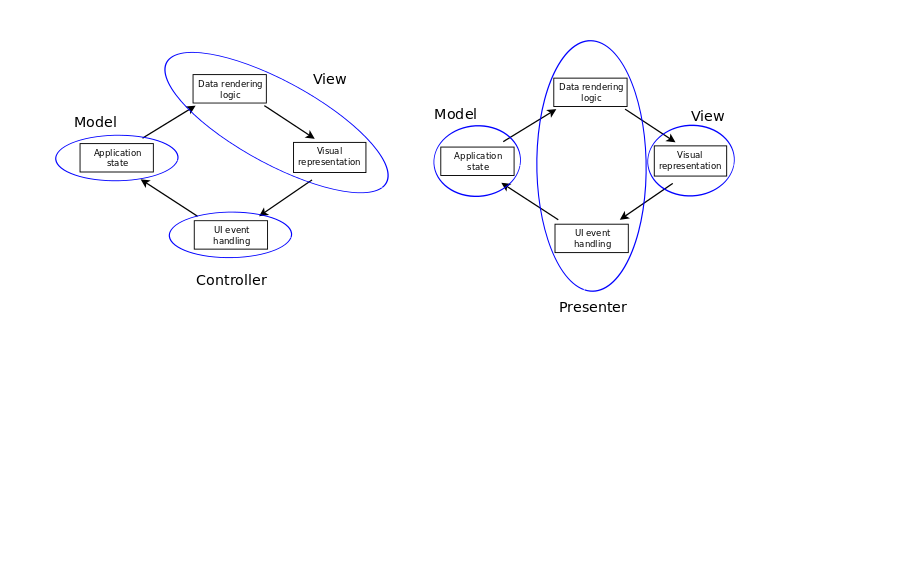

Dolphin Model-View-Presenter
----------------------------

**Additional Need: Rationalize Application model into a more active role**

The Dolphin Model-View-Presenter (MVP) schema is an evolution of 
the Application Model approach. Although it is derived from the Taligent/IBM
strategy with the same name, we will examine Dolphin first as it is simpler to
describe within the concepts we already introduced. The Dolphin strategy is
also the one most often referred as "Model View Presenter" without additional
clarification. To add to the nomenclature, Fowler identifies the Presenter
with the more appropriate "Supervising Controller".

As we introduced in the Application Model section, the main purpose of this
Model is to hold visual state, acting as an intermediate between the Domain
Model and the View/Controller pair. The Application Model was a model in every
respect in terms of design: it performs notifications, remains oblivious of
its listeners, is directly accessed by the View and modified by the Controller.
Yet, due to the strictly specific nature of the visual state, it would be
convenient if the Application Model could handle visual logic and refer to the
View directly, like the Controller does, while still keeping and handling View
state.

Let's analyze the Controller: with widgets of modern GUI toolkits handling
low-level events (e.g. physical keyboard presses), the controller has only the
duty of modifying the models according to higher level events (e.g. textlabel
content modified). These events are then transformed by Controller logic in
actual Model changes, some of which may have an impact on the visual state,
which is stored in the Application Model. It seems like a good idea to have an
Application Model containing this visual state if the assumption is that this
state (e.g. a field being red) is shared among Views. Once again, this state
is almost never shared and mostly tied to a specific View.

Summing up, the roundabout mechanism the Controller uses to take care
of purely visual state would be considerably simplified if we define
a new role, the **Presenter**, which combines the Application Model and the 
Controller in a single entity. 

Like the Application Model, the Presenter:
    
    - holds visual state, and keeps it synchronized against changes in the
      Domain Model
    - converts business rules (e.g. engine rpm number too high)
      into visual representation (e.g. label becomes red)
    - eventually handles state for selection, and application of actions
      to the subset of the Model specified by this selection.

and like the Controller, the Presenter:

    - it is tightly coupled to the View
    - refers to the View directly, and can act on it to alter its 
      visual aspect.
    - handles events forwarded by the View, converting them into action through proper logic.
    - modifies the Domain Model, which contains no visual state
    - handles View logic according to the View state it contains

The Domain Model is a strict domain model and is unchanged, and is still accessed by the View for data
extraction and from the Presenter for data modification. The View 
is an aggregation of widget, fetches data directly from the Domain Model, instead of having to rely
on the Application Model as a forwarder. The View behavior is now hybrid
Active/Passive, fetching Domain data directly from the Domain Model but with
visual aspects applied by the Presenter (Passive) directly acting on the
widgets. A variant with a fully Passive View is possible, and is known as
**Presenter First**.

If the user changes the content of a widget, the presenter is informed, it fetches the value
from the widget, and acts on the model.  The model is listened to by the view, which updates
itself accordingly, and by the presenter itself, which now sets the color.

The view may manipulate its own logic and aspect internally if it does not need to modify the
model.

every view has a specific presenter. There's a strict relationship between the two

Each triad is independent and does not know about the other ones. in general,
if the triads must coordinate each other, they can rely on an "application
model". When the application Model for a given triad is requested to perform a
change, it signals its intention to an application coordinator. This
coordinator can eventually decide to create a new triad, if needed.

FIXME: Add Picture
FIXME: reformulate in general

FIXME: Write something about data transfer objects as a transferring entity of data between the
model and the presenter. It is possible to add a service layer between the
model and the presenter that is responsible for packing the data from the model
into a DTO that the presenter then uses to set the view's contents.

FIXME: The application model approach assumes that there are multiple View/Controllers acting on the
same application model, but in practice it's very rare that an application model is generic enough
to be applicable to multiple views or controllers, exactly because its state is designed to satisfy 
the visual needs of a specific View.

FIXME: Add the fact that the controller is talking to the view as a generic object that generates
events. This allows easy repleaceability of the view, not only with a mock, but also with a different
renderer. As long as it generates the same events and responds to the same interface. this may seem
trivial, but if the difference in interface is large, this replaceability is not achievable.

FIXME: Division of functionality in the presenter must keep into account if the functionality would make
the presenter grow too much and act as a data bottleneck. Sometimes if the logic is complex and the view is
intrinsically complex, it pays off to let this logic live in the View and have a simple presenter.

FIXME: In a large application, a presenter normally handles only one view, but it could
handle multiple views if they are closely related.

FIXME: Communication choices.
 1) View holds reference to the Presenter. View invokes directly methods on the presenter, instead of sending events. or
 2) View emits events. Presenter listens
Presenter holds a reference to the View. directly invokes its methods.

